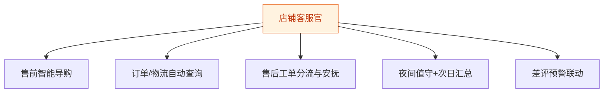
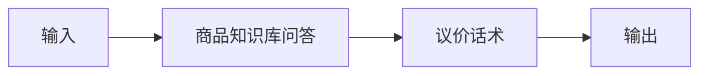
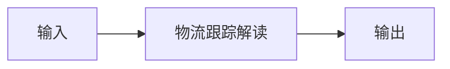
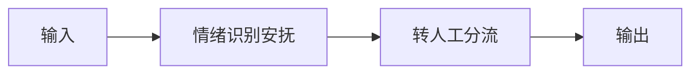
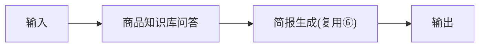
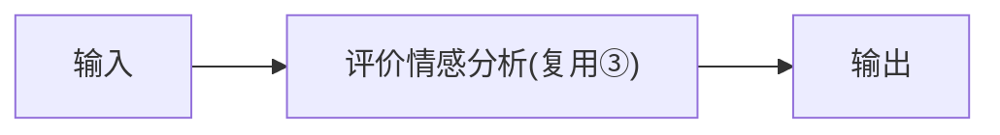

# 店铺客服官 — 工作流流程图

本员工共 **5 条工作流**，下辖 **6 个原子技能**。

## 总览

## 分条详情

### 售前智能导购

| 项目 | 内容 |
|------|------|
| 触发 | 事件（买家消息） |
| 复杂度 | `M` |
| 阶段 | `P0` |
| ROI | 高峰分流，月省 25h≈¥750 |

### 订单/物流自动查询

| 项目 | 内容 |
|------|------|
| 触发 | 事件 |
| 复杂度 | `M` |
| 阶段 | `P0` |
| ROI | 查询类占咨询 40%+ |

### 售后工单分流与安抚

| 项目 | 内容 |
|------|------|
| 触发 | 事件 |
| 复杂度 | `M` |
| 阶段 | `P0` |
| ROI | 拦截情绪波动致差评 |

### 夜间值守+次日汇总

| 项目 | 内容 |
|------|------|
| 触发 | 定时（22:00-8:00 + 8:30 晨报） |
| 复杂度 | `S` |
| 阶段 | `P0` |
| ROI | 夜间丢单挽回，月省 20h≈¥600 |

### 差评预警联动

| 项目 | 内容 |
|------|------|
| 触发 | 事件（新评价） |
| 复杂度 | `S` |
| 阶段 | `P1` |
| ROI | 与③共享链路，零增量成本 |

## 汇总表

| # | 工作流 | 阶段 | 复杂度 | 触发 | 涉及技能数 |
|---|--------|------|--------|------|-----------|
| 1 | 售前智能导购 | `P0` | `M` | 事件（买家消息） | 2 |
| 2 | 订单/物流自动查询 | `P0` | `M` | 事件 | 1 |
| 3 | 售后工单分流与安抚 | `P0` | `M` | 事件 | 2 |
| 4 | 夜间值守+次日汇总 | `P0` | `S` | 定时（22:00-8:00 + 8:30 晨报） | 2 |
| 5 | 差评预警联动 | `P1` | `S` | 事件（新评价） | 1 |

---

*本图由 build_p0_assets.py 自动生成*
