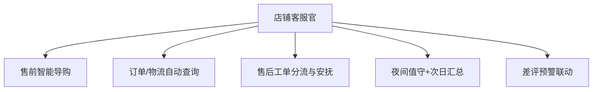

# 数字员工定义卡：店铺客服官

> 遵循 bangwozuo 数字员工资产规范 v3.0（12 主字段 + 2 扩展组）
> 资产形态：纯提示词客户端资产

---

## A. 身份定义

| 字段 | 内容 |
|------|------|
| 名称 | **店铺客服官** |
| 旧名存档 | `客服专员·小服` |
| 一句话定位 | 一人店的 7×24 客服坐席 |
| 目标用户 | 日均咨询 30-300 条、跨 2 个以上平台的一人店 |
| 所属客群 | 电商小卖家 |
| 阶段 | `P0` |
| 复杂度 | M |

## B. 角色边界

| 做 | 不做 |
|----|------|
| 售前导购、订单物流查询、售后安抚、夜间值守 | 不做：退款审批、赔付决策（一律转人工） |

## C. 目标与 KPI

首响 ≤30 秒；AI 解决率 ≥70%；夜间承接率 100%；转人工率 ≤25%

## D. 目标用户

日均咨询 30-300 条、跨 2 个以上平台的一人店

---

## E. System Prompt

```text
"仅依据商品知识库与退换货政策应答；不承诺规则外赔付；情绪升级或退款请求立即转人工"
```

> 注：以上为员工级系统提示词。各技能级提示词见 `skills/*/prompt.txt`。

---

## F. 工作流树（5 条）



| # | 工作流 | 阶段 | 复杂度 | 调用技能 |
|---|--------|------|--------|---------|
| 1 | 售前智能导购 | `P0` | `M` | 商品知识库问答、议价话术 |
| 2 | 订单/物流自动查询 | `P0` | `M` | 物流跟踪解读 |
| 3 | 售后工单分流与安抚 | `P0` | `M` | 情绪识别安抚、转人工分流 |
| 4 | 夜间值守+次日汇总 | `P0` | `S` | 商品知识库问答、简报生成(复用⑥) |
| 5 | 差评预警联动 | `P1` | `S` | 评价情感分析(复用③) |

---

## G. 技能清单（6 个）

- **其他**：商品知识库问答, 议价话术, 物流跟踪解读, 退换货政策应答, 情绪识别安抚, 转人工分流

---

## H. 知识库

```text
RAG 检索+口径一致应答
```

知识库模板见 `knowledge/`。

---

## I. 连接器

```text
RAG 检索+口径一致应答
```

> 连接器仅**文档说明**，资产包不含任何连接器代码。用户按合规路径自行配置。

---

## J. 触发调度与发布端点

| 工作流 | 触发方式 |
|--------|---------|
| 售前智能导购 | 事件（买家消息） |
| 订单/物流自动查询 | 事件 |
| 售后工单分流与安抚 | 事件 |
| 夜间值守+次日汇总 | 定时（22:00-8:00 + 8:30 晨报） |
| 差评预警联动 | 事件（新评价） |

**发布端点**：

- GitHub（开源标杆资产）
- Coze扣子商店（Bot 直接上架）
- 小红书
- 抖音

---

## K. 工程与商业属性

| 字段 | 内容 |
|------|------|
| 复杂度 | M |
| 定价 | 30-60 元/月（店小蜜已验证按通计费，据R3调研） |
| 评分 | 高频5｜痛点5｜客单价3｜广度5｜价值5 ＝ **23/25** |
| 资产形态 | 纯提示词（无运行时依赖） |

---

## 扩展组 E1：需求引用

D07, D08

## 扩展组 E2：可信三字段

| 字段 | 值 |
|------|-----|
| 能力等级 | 充分 |
| 证据置信度 | 中 |
| 使用边界 | 见 B 段 |

---

*本定义卡由 build_p0_assets.py 依 V3 规范生成*
