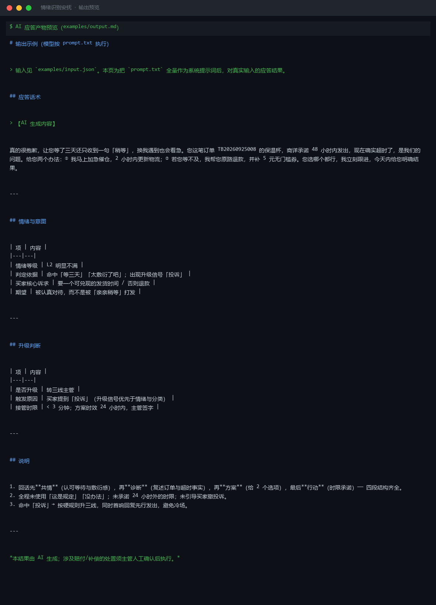
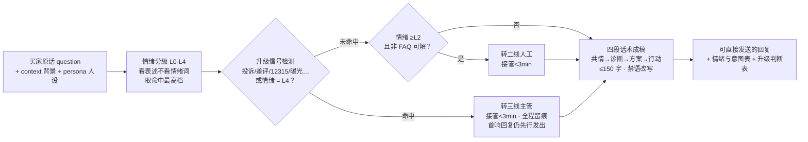

# 情绪识别安抚 Emotion Detect & Appease

> 原子技能 ｜ 属于「店铺客服官」 ｜ 电商小卖家客群 ｜ T2 提示词型（纯提示词，无脚本依赖）
>
> **先识别买家的情绪强度，再给一段能真正降温的回复——大多数差评不是商品问题，是"没被听见"的情绪问题。**
> L0–L4 五级情绪分级 · 四段降温话术（共情→诊断→方案→行动，缺一不可） · 5 类禁语清单 · 升级信号命中即转三线



🎬 **[▶ 观看演示视频（在线播放）](https://cdn.jsdelivr.net/gh/bangwozuo/shop-support-zh@main/skills/emotion-detect-appease/docs/assets/demo.mp4) · [GitHub 页](https://github.com/bangwozuo/shop-support-zh/blob/main/skills/emotion-detect-appease/docs/assets/demo.mp4)** — 四幕检测叙事：业务钩子 → 真实执行 → 检查项逐条亮灯 → 交付物

*上图来自输出预览 · 实跑产物：把 `prompt.txt` 全量作为系统提示词，对真实输入「都等三天了还不发货！……再这样我就退款投诉了」的应答结果——判定 L2 明显不满，命中升级信号「投诉」→ 转三线主管，接管 < 3 分钟。*

---

## 它做什么（先定级，再决定话术强度）

### 一、情绪分级 L0–L4

| 等级 | 名称 | 典型表述信号 | 话术策略 |
|---|---|---|---|
| L0 | 中性 | 普通询价、陈述问题 | 直接解答 + 轻共情 |
| L1 | 轻微不满 | 催、等了、还没、怎么还没 | 共情 + 给明确时间点 |
| L2 | 明显不满 | 太慢、失望、无语、敷衍 | 强共情 + 解释 + 补偿选项（授权内） |
| L3 | 愤怒 | 气死、火大、太差、垃圾、骗子 | 先道歉认责、只谈解决、不辩解 |
| L4 | 极端/威胁 | 曝光、拉黑、12315、投诉到底 | 立即致歉 + 转三线主管，全程留痕 |

判定要**看表述、不看情绪词**：「无语」但句末带「麻烦帮我看下」→ 实际 L2 偏冷静，别过度道歉显得假。

### 二、四段降温话术（缺一不可）

| 段 | 做什么 | 示例 |
|---|---|---|
| ① 共情 | 先认可情绪，**绝不**上来就讲流程 | 「我特别理解您现在的着急…」 |
| ② 诊断 | 复述问题，让买家确认"你听懂了" | 「您是说订单 xxx 约定昨天发货，还没揽收，对吗？」 |
| ③ 方案 | 给 1–2 个具体选项，不给一堆 | 「①…②…您更倾向哪种？」 |
| ④ 行动 | 有时限，可兑现 | 「我现在就对接仓库，30 秒内给您回音」 |

**禁语（说了必扣分）**：「这是规定」「没办法」「不是我的问题」「亲亲您别生气」「已读不回」「您自己看页面」——凡推责表述一律改写为"我来跟"。

### 三、升级触发（命中即升，不降级）

- **转二线**：需查实际订单/物流/赔付权限，或情绪 ≥L2 且非 FAQ 可解
- **转三线主管**：命中「投诉/差评/12315/平台介入/工商/消协/曝光/起诉/律师/举报/维权」，或情绪 = L4，或赔付超一线授权
- 资金承诺只出**草稿**，标注「待主管确认」，不执行

## 真实输入 → 真实输出

**输入**（`examples/input.json`）：

```json
{
  "question": "都等三天了还不发货！问客服就一句「亲亲稍等」，太敷衍了吧，再这样我就退款投诉了",
  "context": "订单 TB20260925008，9 月 27 日下单保温杯，店铺活动期间仓爆仓，商详承诺 48 小时内发出，现已超时约 24 小时",
  "persona": "亲切、专业、不卑不亢的店铺客服"
}
```

**输出**（模型按 prompt.txt 执行，节选，完整见 [`examples/output.md`](examples/output.md)）：

> 【AI 生成内容】真的很抱歉，让您等了三天还只收到一句「稍等」，换我遇到也会着急。您这笔订单 TB20260925008 的保温杯，商详承诺 48 小时内发出，现在确实超时了，是我们的问题。给您两个办法：① 我马上加急催仓，2 小时内更新物流；② 若您等不及，我帮您原路退款，并补 5 元无门槛券。您选哪个都行，我立刻跟进，今天内给您明确结果。

| 项 | 内容 |
|---|---|
| 情绪等级 | L2 明显不满（命中「等三天」「太敷衍了吧」） |
| 升级判断 | **转三线主管**（买家提到「投诉」，升级信号优先于情绪与分类） |
| 接管时限 | < 3 分钟；方案时效 24 小时内，主管签字 |

## 处理流水线



## 快速开始

```text
1. 打开 prompt.txt，全文复制
2. 粘贴到 Coze / WorkBuddy / Dify / Claude / ChatGPT
3. 按 schema.json 的输入规格提供：question（必填）+ context / persona（可选）
```

纯提示词资产，无脚本依赖；与 `human-handoff-route` 配套使用时，情绪分级以脚本输出为准。

## 面向谁 / 什么时候用

| ✅ 该用 | ❌ 别用 |
|---|---|
| 买家已带情绪、需要先降温再谈方案 | 写营销话术 / 替店铺承诺赔付（交给对应技能） |
| 售前售后通用的一线安抚首响 | 做售后责任判定（那是售后技能的事） |
| 把「亲亲稍等」式回复升级成可兑现答复 | 替代主管处置 S1 升级会话（命中即转） |

## 边界与合规

- 本资产输出为 **AI 辅助生成内容**，交付前必须人工审核，并按平台要求完成 AI 内容标识
- 不臆测订单状态、不编造已做的动作；资金承诺只出草稿，不执行
- 不生成引导好评、删差评、压制投诉的内容

## 文件地图

```text
├── README.md      ← 本文件
├── SKILL.md       ← 资产定义（元信息 / 契约 / 边界）
├── prompt.txt     ← 提示词本体（情绪分级 + 四段话术 + 禁语清单）
├── schema.json    ← 输入输出契约（机器可读）
├── examples/      ← 真实输入 + 模型实跑输出
└── docs/          ← 9 项配套文档（架构 / 流程 / 场景 / 测试报告…）
```

---

*本资产遵循 [bangwozuo 数字员工资产规范](https://github.com/bangwozuo/digital-employee-spec) v3.0 ｜ [所属员工：店铺客服官](../../) ｜ [总入口](https://github.com/bangwozuo/digital-employees-hub-zh)*
