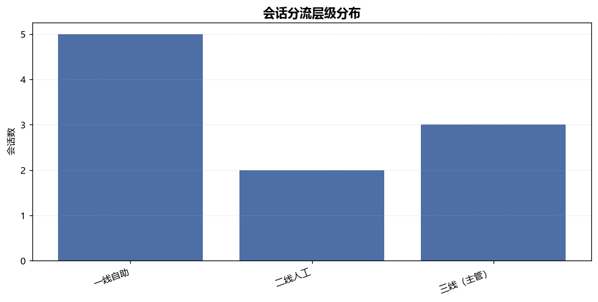
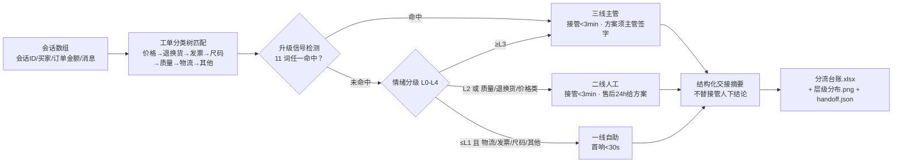

# 转人工分流 Human Handoff Route

> 原子技能 ｜ 属于「店铺客服官」 ｜ 电商小卖家客群 ｜ T1 产物型（脚本交付真实文件）
>
> **对每通买家会话判定「该由谁、在多久内」处理，交出能让接管人一眼看懂的交接摘要。**
> 7 类工单分类树 · L0–L4 五级情绪分级 · 11 个升级信号词 · 三层路由 SLA（首响 <30 秒 / 接管 <3 分钟 / 售后 24 小时给方案）


🎬 **[▶ 观看高清完整版（mp4）](https://cdn.jsdelivr.net/gh/bangwozuo/shop-support-zh@main/skills/human-handoff-route/docs/assets/demo.mp4)** — 四幕创作叙事：业务钩子 → 真实执行 → 要点到成稿演变 → 交付物

*上图来自真实执行：`python scripts/handoff_route.py --demo`，10 条会话一次分流——一线自助 5 / 二线人工 2 / 三线主管 3，人工介入占比 50.0%，2 条命中升级信号，产物落盘 Excel + PNG + JSON。*

---

## 它做什么（三层分流，判定顺序：升级信号 → 情绪 → 分类）

### 一、工单分类树（自上而下，先具体后宽泛）

| 主分类 | 典型子问题 | 命中词（示例） |
|---|---|---|
| 价格 | 价保 / 活动差 / 补差价 | 价保、补差价、降价、买贵 |
| 退换货 | 退货 / 换货 / 退款 | 退货、换货、退款、七天无理由 |
| 发票 | 专票 / 普票 / 税号 | 发票、开票、税号、专票 |
| 尺码不合适 | 偏大 / 偏小 / 不合脚 | 尺码、偏大、偏小、穿不下 |
| 质量 | 破损 / 色差 / 功能故障 | 破损、色差、坏了、没声音 |
| 物流 | 未发货 / 在途 / 丢件 / 超区 | 发货、物流、快递、签收、超区 |
| 其他 | 未归类 | — |

### 二、情绪分级 L0–L4 与升级信号

| 等级 | 含义 | 触发词（示例） |
|---|---|---|
| L0 | 中性 | 正常询价、咨询 |
| L1 | 轻微不满 | 催、等了、还没、怎么还没 |
| L2 | 明显不满 | 太慢、失望、无语、敷衍 |
| L3 | 愤怒 | 气死、火大、太差、垃圾、骗子 |
| L4 | 极端/威胁 | 曝光、拉黑、举报、找你麻烦 |

**升级信号（命中任一即升三线，不降级）**：投诉、差评、12315、平台介入、工商、消协、曝光、起诉、律师、举报、维权——共 11 词。

### 三、三层路由与 SLA

| 层级 | 触发条件 | 接管时限 | 方案时效 |
|---|---|---|---|
| 一线自助 | 物流/发票/尺码/其他 且 情绪 ≤L1 且无升级信号 | AI 即时，首响 < 30 秒 | 即刻答复 |
| 二线人工 | 质量/退换货/价格类，或情绪 = L2 | 接管 < 3 分钟 | 售后 24 小时内给方案 |
| 三线（主管） | 命中升级信号，或情绪 ≥ L3 | 接管 < 3 分钟 | 24 小时内给方案，**主管签字** |

## 真实输入 → 真实输出

**输入**（`examples/input.json`，10 条会话）：买家A「等了三天了怎么还没发货」、买家E「耳机左耳没声音……再不处理我就投诉到12315！」、买家G「敷衍我两天了，我要曝光你们、给差评！」等。

**输出**（脚本实跑，节选）：

| 会话ID | 主分类 | 情绪等级 | 升级信号 | 分流层级 | 接管时限 |
|---|---|---|---|---|---|
| C-1001 | 物流 | L1 轻微不满 | — | 一线自助 | AI/自助即时 |
| C-1002 | 质量 | L2 明显不满 | — | 二线人工 | < 3 分钟 |
| C-1005 | 退换货 | L3 愤怒 | 投诉、12315 | 三线（主管） | < 3 分钟 |
| C-1007 | 其他 | L4 极端/威胁 | 差评、曝光 | 三线（主管） | < 3 分钟 |
| C-1010 | 质量 | L3 愤怒 | — | 三线（主管） | < 3 分钟 |

**交接摘要样例**（可直接接管）：

```text
[C-1005] 主诉「退换货」，情绪 L3 愤怒；命中升级信号：投诉、12315；
路由至三线（主管）；接管时限 < 3 分钟，方案时效 24 小时内给方案，主管签字。
```

完整台账见 [`examples/output.md`](examples/output.md)；产物：`out/分流台账.xlsx`（分流台账/分类分布/SLA对照/升级信号明细 4 个 sheet）+ 层级分布图：



## 处理流水线



## 快速开始

**方式一：提示词（任意 AI 工具）**

```text
1. 打开 prompt.txt，全文复制
2. 粘贴到 Coze / WorkBuddy / Dify / Claude / ChatGPT
3. 按 schema.json 的输入规格提供：conversations 会话数组
```

**方式二：脚本（零 AI 依赖，确定性判定）**

```bash
# 演示模式（内置 10 条真实样例）
python scripts/handoff_route.py --demo
# 指定输入
python scripts/handoff_route.py --input examples/input.json --outdir out
```

依赖与修复提示见脚本头部；缺失时脚本会打印安装命令，不静默失败。

## 面向谁 / 什么时候用

| ✅ 该用 | ❌ 别用 |
|---|---|
| 客服接待前的批量会话预分流（脚本模式可批量） | 替代主管做赔付审批（只路由，不决策） |
| 升级会话要 3 分钟内找到接管人 | 在摘要里承诺补偿（越权，禁止） |
| 交接班要让接管人一眼看懂上下文 | 抓取需登录的私域会话数据 |

## 边界与合规

- 本资产输出为 **AI 辅助生成内容**，交付前必须人工审核，并按平台要求完成 AI 内容标识
- 分流是「路由」不是「答复」：不承诺退款、补偿、赔偿；资金相关仅生成草稿
- 升级信号命中即升三线，不做降级；不泄露买家手机号、地址、支付信息

## 文件地图

```text
├── README.md                ← 本文件
├── SKILL.md                 ← 资产定义（元信息 / 契约 / 边界）
├── prompt.txt               ← 提示词本体（分类树 + 情绪分级 + SLA + 输出格式）
├── schema.json              ← 输入输出契约（机器可读）
├── scripts/handoff_route.py ← 确定性判定脚本（分类/情绪/升级/路由 → Excel/PNG/JSON）
├── examples/                ← 真实输入 + 脚本实跑输出
├── docs/                    ← 9 项配套文档（架构 / 流程 / 场景 / 测试报告…）
└── out/                     ← 实跑产物（分流台账.xlsx / 分流层级分布.png / handoff.json）
```

---

*本资产遵循 [bangwozuo 数字员工资产规范](https://github.com/bangwozuo/digital-employee-spec) v3.0 ｜ [所属员工：店铺客服官](../../) ｜ [总入口](https://github.com/bangwozuo/digital-employees-hub-zh)*
