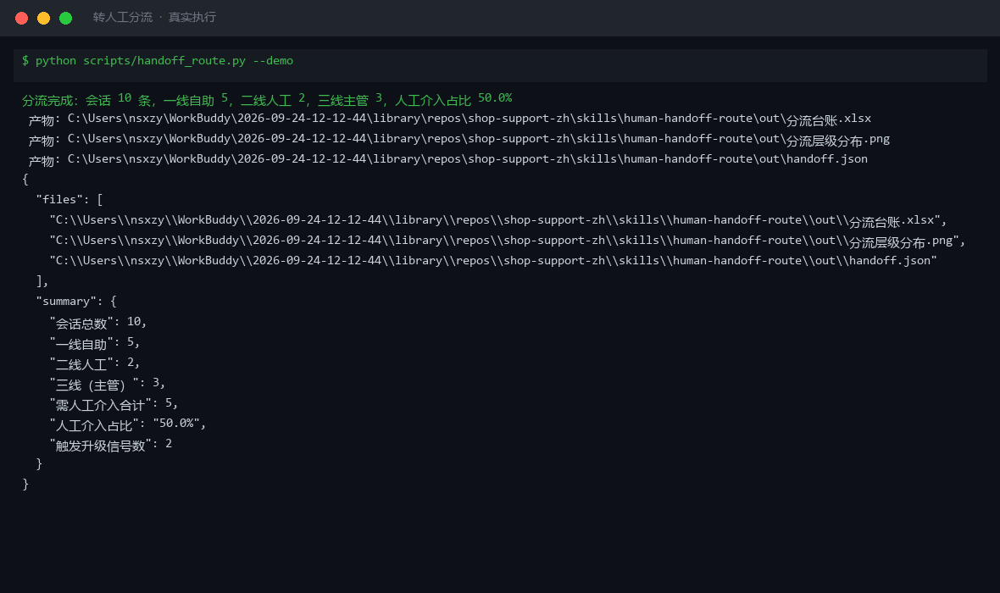

# 截图与录屏

> 以下素材均来自**真实执行**：`--run` 实拍终端 / 实跑产物文件，无摆拍。

## 演示视频


*四幕创作叙事（Hyperframes 动态渲染 19s）：业务钩子 → 真实执行 → 输入要点到成稿演变 → 交付物*

## 执行截图



## 实跑产物

| 文件 | 说明 |
|---|---|
| [`out/handoff.json`](out/handoff.json) | 结构化结果（实跑生成） · 6 KB |
| [`out/分流台账.xlsx`](out/分流台账.xlsx) | Excel 工作簿（实跑生成） · 9 KB |
| [`out/分流层级分布.png`](out/分流层级分布.png) | 图表产物（实跑生成） · 22 KB |


---

## 附录：实跑输出明细

> 本资产为纯提示词客户端资产，无界面可截图。以下为**实跑运行效果**。

## 运行效果

### 输入

```json
{
  "items": [
    "示例条目 A",
    "示例条目 B"
  ],
  "taxonomy": "（分类体系：类别定义与判定标准（可选，缺省由你提出））"
}

```

### 输出

## 分类结果

> 【AI 生成内容】

由于未提供具体分类体系，现依据通用客服场景提出以下分类标准并进行打标：

| # | 条目 | 类别 | 判定依据 |
|---|---|---|---|
| 1 | 示例条目 A | 信息不完整 / 待补充 | 仅为占位描述，无实质内容，无法判断业务归属 |
| 2 | 示例条目 B | 信息不完整 / 待补充 | 仅为占位描述，无实质内容，无法判断业务归属 |

---

## 分布统计

| 类别 | 数量 | 占比 |
|---|---|---|
| 信息不完整 / 待补充 | 2 | 100% |

---

## 存疑项

1. 输入条目为纯占位符（"示例条目 A/B"），缺乏实际语义，无法应用真实分类体系。
2. 建议补充具体条目内容（如用户问题、工单描述、对话记录等）后重新执行分类。


---

*运行效果由实跑验证生成*
