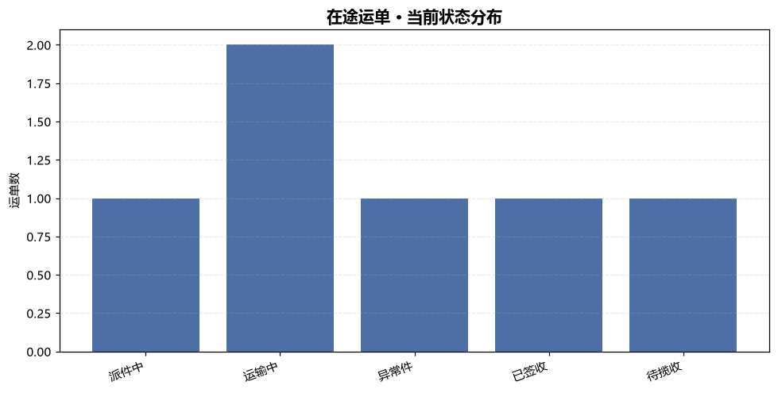
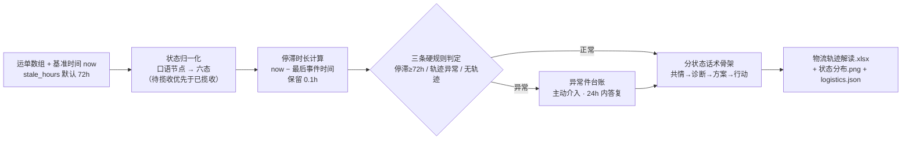

# 物流跟踪解读 Logistics Track Parse

> 原子技能 ｜ 属于「店铺客服官」 ｜ 电商小卖家客群 ｜ T1 产物型（脚本交付真实文件）
>
> **把一串原始物流轨迹翻译成买家能看懂的「当前状态 + 下一步」，并把需要主动介入的异常件挑出来。**
> 六态状态归一化 · 3 条异常硬规则（停滞 ≥72h / 轨迹异常 / 无轨迹） · 6 家承运商口径（顺丰/中通/圆通/韵达/京东/EMS） · 分状态话术模板


🎬 **[▶ 观看演示视频（在线播放）](https://cdn.jsdelivr.net/gh/bangwozuo/shop-support-zh@main/skills/logistics-track-parse/docs/assets/demo.mp4) · [GitHub 页](https://github.com/bangwozuo/shop-support-zh/blob/main/skills/logistics-track-parse/docs/assets/demo.mp4)** — 四幕检测叙事：业务钩子 → 真实执行 → 检查项逐条亮灯 → 交付物

*上图来自真实执行：`python scripts/logistics_parse.py --demo`，6 个运单一次解读——正常件 3 / 异常件 3（异常率 50.0%），基准时间 2026-09-30 09:00，产物落盘 Excel + PNG + JSON。*

---

## 它做什么（先归一状态，再判异常，后给话术）

### 一、状态归一化（六态，自上而下匹配，先具体后宽泛）

| 归一化状态 | 命中关键词（示例） |
|---|---|
| 已签收 | 已签收、妥投、代收、已取件 |
| 异常件 | 退回、拒收、滞留、丢失、损坏、超区、异常 |
| 派件中 | 派件、派送、正在投递、安排投递 |
| 运输中 | 运输、中转、发往、到达、离开、干线 |
| 待揽收 | 待揽收、待收件、已下单、等待揽收 |
| 已揽收 | 已揽收、揽收、已收件、收寄 |

⚠️ 「待揽收」必须优先于「已揽收」匹配，否则「快件待揽收」会被误判——脚本已按此顺序实现。

### 二、异常判定（三条硬规则）

| # | 规则 | 阈值/条件 | 处置 |
|---|---|---|---|
| 1 | 超时停滞 | 非已签收，距最后轨迹 ≥ `stale_hours`（默认 **72 小时**） | 主动介入，24 小时内给明确答复 |
| 2 | 轨迹异常 | 归一化为「异常件」（退回/拒收/滞留/超区/丢失/损坏） | 同上，并提示核对地址/改址 |
| 3 | 无轨迹 | 运单无任何有效时间事件 | 标「无轨迹」，提示核对单号或查件 |

### 三、分状态话术骨架

| 状态 | 话术要点 |
|---|---|
| 待揽收 | 已下单，仓库打包中，预计 48 小时内揽收 |
| 运输中 | 在途运输，到达派件网点会更新「派件中」 |
| 派件中 | 快递员正在派送，请保持电话畅通 |
| 已签收 | 未收到先核门卫/驿站，无果即刻查件 |
| 异常件 | 已主动联系承运方核查，24 小时内答复 |

话术结构：共情 → 诊断（复述当前位置）→ 方案 → 行动；禁止「这是规定」「没办法」。

## 真实输入 → 真实输出

**输入**（`examples/input.json`，6 单 + `now: 2026-09-30 09:00`）：顺丰在途派件、圆通长期停滞、中通「退回发件人，原因：收件地址超区」、京东已签收、EMS 停滞超阈值、韵达「快件待揽收」。

**输出**（脚本实跑，节选）：

| 运单号 | 承运商 | 当前状态 | 停滞小时 | 异常判定 | 话术建议 |
|---|---|---|---|---|---|
| SF1380001112223 | 顺丰 | 派件中 | 13.9 | 正常 | 快递员正在派送，请保持电话畅通 |
| YT7600123456789 | 圆通 | 运输中 | 95.3 | ⚠️ 超 72 小时无更新 | 到达派件网点后会更新「派件中」 |
| ZTO5500987654321 | 中通 | 异常件 | 88.5 | ⚠️ 轨迹异常（超区退回） | 已主动联系承运方核查，24 小时内答复 |
| JD0033112255667 | 京东物流 | 已签收 | 17.3 | 正常 | 未收到先核门卫/驿站 |
| EMS9988776655443 | EMS | 运输中 | 263.0 | ⚠️ 超 72 小时无更新 | 到达派件网点后会更新「派件中」 |
| YUNDA7711223344 | 韵达 | 待揽收 | 0.8 | 正常 | 预计 48 小时内揽收 |

完整 6 单解读 + 异常件台账 + 事件明细见 [`examples/output.md`](examples/output.md)；产物：`out/物流轨迹解读.xlsx` + 状态分布图：



## 处理流水线



## 快速开始

**方式一：提示词（任意 AI 工具）**

```text
1. 打开 prompt.txt，全文复制
2. 粘贴到 Coze / WorkBuddy / Dify / Claude / ChatGPT
3. 按 schema.json 的输入规格提供：shipments 运单数组（+ now / stale_hours）
```

**方式二：脚本（零 AI 依赖，确定性解析）**

```bash
# 演示模式（内置 6 单真实样例）
python scripts/logistics_parse.py --demo
# 指定输入
python scripts/logistics_parse.py --input examples/input.json --outdir out
```

## 面向谁 / 什么时候用

| ✅ 该用 | ❌ 别用 |
|---|---|
| 「我的快递到哪了」类咨询的自动应答 | 查库查轨迹（不查库，只用给定事件还原事实） |
| 批量运单巡检，挑出要主动介入的异常件 | 把「无轨迹」直接判丢件（须承运方出险） |
| 催发货/催物流话术无头绪，要分状态模板 | 承诺具体到货时间（不编「明天到」） |

## 边界与合规

- 本资产输出为 **AI 辅助生成内容**，交付前必须人工审核，并按平台要求完成 AI 内容标识
- 不泄露快递员真实手机号、买家地址（脱敏后输出）；不用「最慢」「最差」贬损承运商
- 涉及丢件、赔付、改址的答复须经人工确认；轨迹数据只走官方/授权接口

## 文件地图

```text
├── README.md                 ← 本文件
├── SKILL.md                  ← 资产定义（元信息 / 契约 / 边界）
├── prompt.txt                ← 提示词本体（六态归一 + 异常规则 + 分状态话术）
├── schema.json               ← 输入输出契约（机器可读）
├── scripts/logistics_parse.py← 确定性解析脚本（归一化/停滞/异常 → Excel/PNG/JSON）
├── examples/                 ← 真实输入 + 脚本实跑输出
├── docs/                     ← 9 项配套文档（架构 / 流程 / 场景 / 测试报告…）
└── out/                      ← 实跑产物（物流轨迹解读.xlsx / 物流状态分布.png / logistics.json）
```

---

*本资产遵循 [bangwozuo 数字员工资产规范](https://github.com/bangwozuo/digital-employee-spec) v3.0 ｜ [所属员工：店铺客服官](../../) ｜ [总入口](https://github.com/bangwozuo/digital-employees-hub-zh)*
