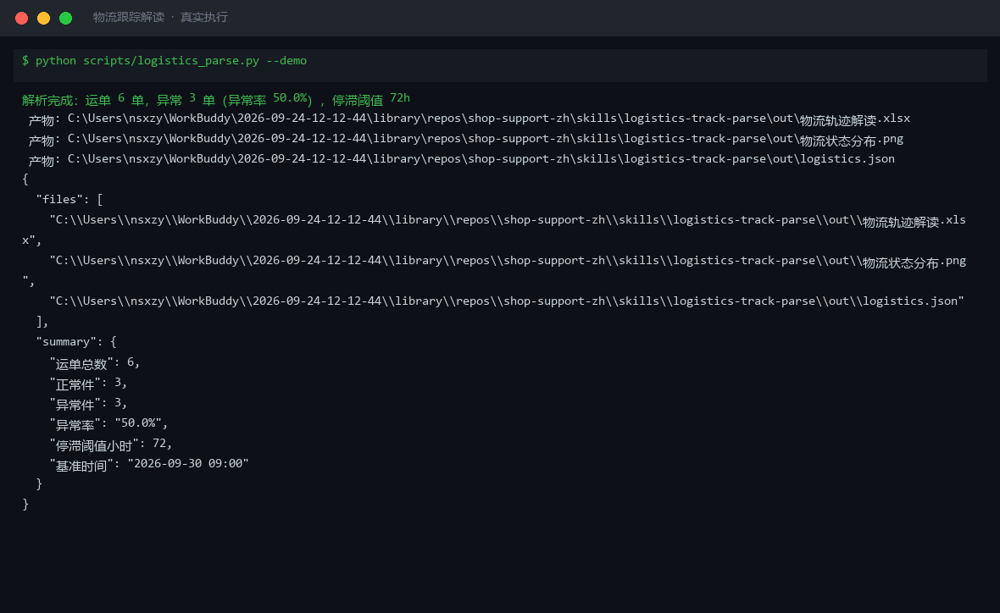

# 截图与录屏

> 以下素材均来自**真实执行**：`--run` 实拍终端 / 实跑产物文件，无摆拍。

## 演示视频


*Hyperframes 动态渲染 15s：命令逐字敲入（光标闪烁）→ 19 行真实输出逐行流式 → 实跑产物 Ken Burns 缓推*

## 执行截图



## 实跑产物

| 文件 | 说明 |
|---|---|
| [`out/logistics.json`](out/logistics.json) | 结构化结果（实跑生成） · 5 KB |
| [`out/物流状态分布.png`](out/物流状态分布.png) | 图表产物（实跑生成） · 31 KB |
| [`out/物流轨迹解读.xlsx`](out/物流轨迹解读.xlsx) | Excel 工作簿（实跑生成） · 11 KB |


---

## 附录：实跑输出明细

> 本资产为纯提示词客户端资产，无界面可截图。以下为**实跑运行效果**。

## 运行效果

### 输入

```json
{
  "document": "需要处理的原始文本内容（请替换为真实内容）",
  "schema_hint": "抽取价格、库存、卖点"
}

```

### 输出

## 结构化字段

> 【AI 生成内容】

| 项 | 内容 |
|----|------|
| 价格 | 缺失（未提供可解析文本） |
| 库存 | 缺失（未提供可解析文本） |
| 卖点 | 缺失（未提供可解析文本） |
| 原始文本 | "需要处理的原始文本内容（请替换为真实内容）" |

---

## 缺失与风险项

1. **document 字段为占位符**：输入的 `document` 无实质内容，无法抽取任何结构化字段。
2. **schema_hint 与实际内容不匹配**：即使提供 schema_hint（价格、库存、卖点），也因缺乏源文本而无法填充。
3. **建议操作**：请替换 `document` 为真实物流轨迹、商品详情或合同文本后重新执行解析。


---

*运行效果由实跑验证生成*
