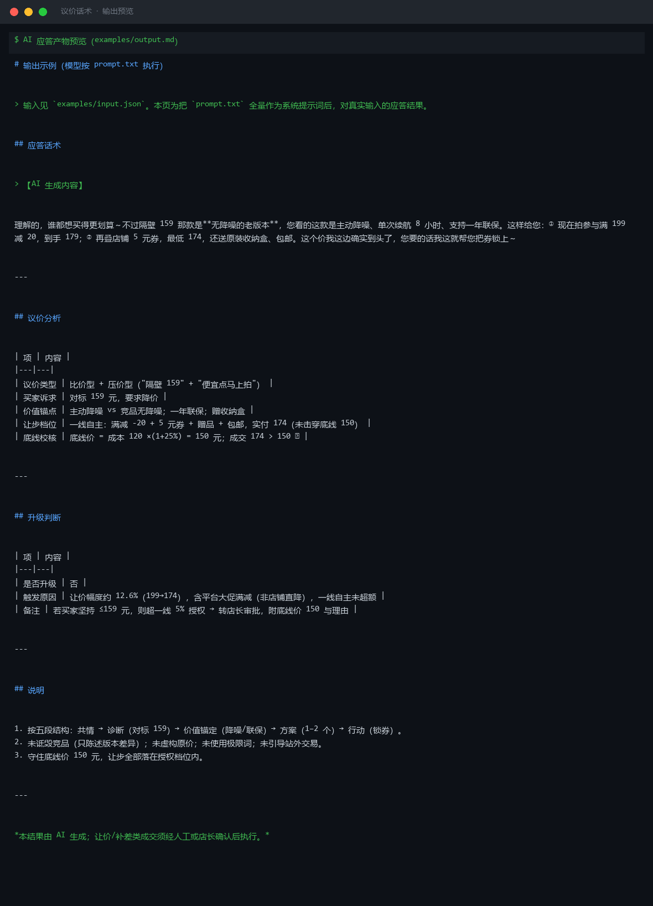
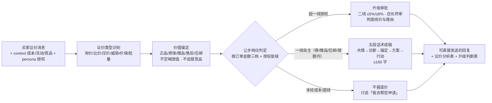

# 议价话术 Price Negotiation Script

> 原子技能 ｜ 属于「店铺客服官」 ｜ 电商小卖家客群 ｜ T2 提示词型（纯提示词，无脚本依赖）
>
> **在不击穿底线价的前提下，把想走的买家留住——武器是价值锚定 + 授权内的有限让步，不是无底线降价。**
> 6 类议价识别（询价/比价/压价/威胁/价保/批量） · 三档让步梯度（一线/二线/店长） · 底线价公式 `成本 × (1+最低毛利率)` · 五段话术结构




*上图来自输出预览 · 实跑产物：把 `prompt.txt` 全量作为系统提示词，对真实输入「隔壁家同款才 159，便宜点我马上拍」的应答结果——判定比价型 + 压价型，成交 174 元 > 底线 150 元 ✅，一线自主未超额。*

---

## 它做什么（先识别类型，再按授权让步）

### 一、议价类型识别（决定用什么话术）

| 类型 | 典型表述 | 应对主轴 |
|---|---|---|
| 询价型 | 多少钱 / 有优惠吗 | 报活动价 + 凑单更省 |
| 比价型 | 别家更便宜 / 某平台才 xx 元 | 讲差异价值（正品、售后、赠品），**不诋毁竞品** |
| 压价型 | 便宜点 / 抹个零 / 再送点 | 有限让步 + 条件交换 |
| 威胁型 | 不便宜就买别家 | 不追着降价；给"再考虑"台阶 + 一次性最优案 |
| 价保型 | 刚买就降价 / 能补差价吗 | 核对价保期与规则，符合即补 |
| 批量/复购型 | 买两件 / 老客户 | 阶梯价或满减，走授权审批 |

### 二、让步梯度（授权内，永远从最低档起）

| 订单金额 | 一线可自主 | 需二线审批 | 需店长审批 |
|---|---|---|---|
| < 50 元 | 抹零 / 送 1 件赠品 | 1–3 元券 | 超 3 元让价 |
| 50–200 元 | 活动券 + 包邮 + 赠品 | 让价 ≤ 5% | 让价 > 5% |
| > 200 元 | 活动券 + 赠品 + 包邮 | 让价 ≤ 8% | 让价 > 8% |

**底线价 = 成本价 × (1 + 最低毛利率)**，任何情况不得击穿；未给成本时一律不报"最低价"，改用「我去帮您申请」。能用券/赠品/包邮解决就不直接降价。

### 三、价保规则

淘宝/天猫普通商品价保 **15 天**（大促常见 30 天，以活动页公示为准）；抖店以订单页价保协议为准。符合条件引导走平台价保入口补差；不符合给替代方案（券/赠品），**不私下承诺补现金**。

## 真实输入 → 真实输出

**输入**（`examples/input.json`）：

```json
{
  "question": "老板这个耳机199太贵了吧，隔壁家同款才159，便宜点我马上拍",
  "context": "商品：无线降噪耳机，标价 199 元，成本 120 元，最低毛利率 25%（底线价 150 元）；当前活动：满 199 减 20；竞品 159 元为无降噪老版本；买家为首次咨询、有明确下单意向",
  "persona": "一线客服，可自主用券/赠品/包邮，直接让价上限 5%（约 10 元）"
}
```

**输出**（模型按 prompt.txt 执行，节选，完整见 [`examples/output.md`](examples/output.md)）：

> 【AI 生成内容】理解的，谁都想买得更划算～不过隔壁 159 那款是**无降噪的老版本**，您看的这款是主动降噪、单次续航 8 小时、支持一年联保。这样给您：① 现在拍参与满 199 减 20，到手 179；② 再叠店铺 5 元券，最低 174，还送原装收纳盒、包邮。这个价我这边确实到头了，您要的话我这就帮您把券锁上～

| 项 | 内容 |
|---|---|
| 议价类型 | 比价型 + 压价型（"隔壁 159" + "便宜点马上拍"） |
| 让步档位 | 一线自主：满减 -20 + 5 元券 + 赠品 + 包邮，实付 174 |
| 底线校核 | 底线价 = 成本 120 ×(1+25%) = **150 元**；成交 174 > 150 ✅ |

## 处理流水线



## 快速开始

```text
1. 打开 prompt.txt，全文复制
2. 粘贴到 Coze / WorkBuddy / Dify / Claude / ChatGPT
3. 按 schema.json 的输入规格提供：question（必填）+ context / persona（可选）
```

纯提示词资产，无脚本依赖；与 `presale-guide-flow` 工作流配套时，让步档位以工作流脚本输出为准。

## 面向谁 / 什么时候用

| ✅ 该用 | ❌ 别用 |
|---|---|
| 买家砍价、比价、要优惠的接待应对 | 无底线降价换成交（击穿底线价） |
| 让步前先校验授权档位与底线 | 虚构原价、玩假活动（违反《价格法》） |
| 给"再考虑"台阶，留住意向买家 | 诋毁竞品拉踩（违反《反不正当竞争法》） |

## 边界与合规

- 本资产输出为 **AI 辅助生成内容**，交付前必须人工审核，并按平台要求完成 AI 内容标识
- 不诋毁、贬低竞品；不虚构原价、不搞虚假促销；超授权让价必须走审批
- 价保差额走平台官方入口，不私下承诺补现金

## 文件地图

```text
├── README.md      ← 本文件
├── SKILL.md       ← 资产定义（元信息 / 契约 / 边界）
├── prompt.txt     ← 提示词本体（类型识别 + 让步梯度 + 五段话术）
├── schema.json    ← 输入输出契约（机器可读）
├── examples/      ← 真实输入 + 模型实跑输出
└── docs/          ← 9 项配套文档（架构 / 流程 / 场景 / 测试报告…）
```

---

*本资产遵循 [bangwozuo 数字员工资产规范](https://github.com/bangwozuo/digital-employee-spec) v3.0 ｜ [所属员工：店铺客服官](../../) ｜ [总入口](https://github.com/bangwozuo/digital-employees-hub-zh)*
