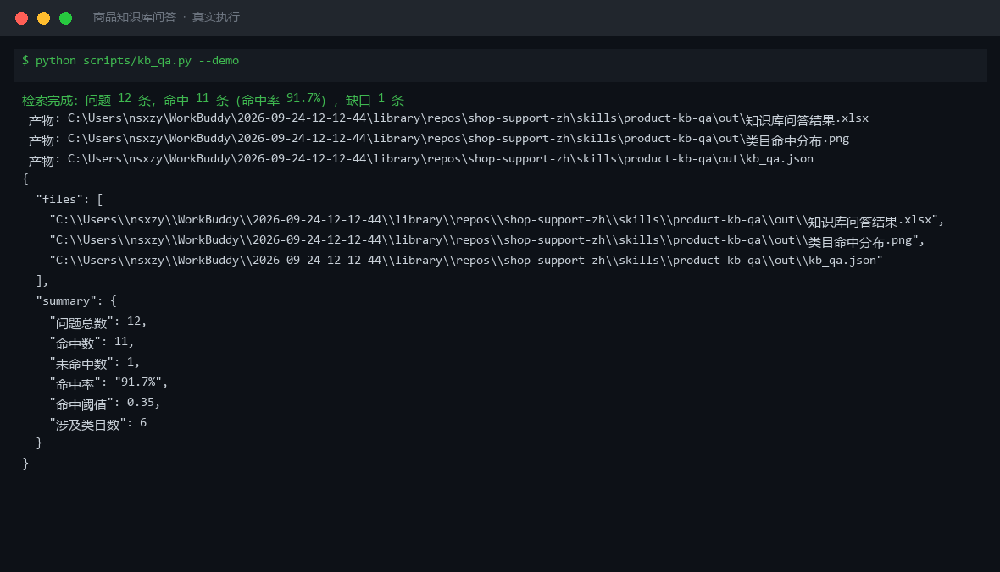
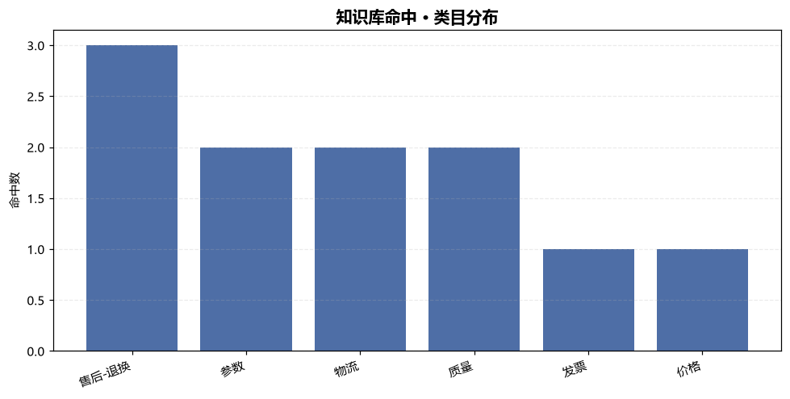
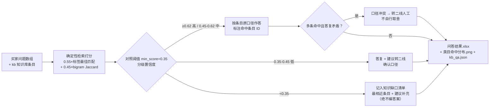

# 商品知识库问答 Product KB QA

> 原子技能 ｜ 属于「店铺客服官」 ｜ 电商小卖家客群 ｜ T1 产物型（脚本交付真实文件）
>
> **只在店铺知识库范围内作答，每条答复可回溯到条目 ID；没有的内容明确列为缺口，绝不用常识补全。**
> 打分公式 `0.55×标签匹配 + 0.45×bigram Jaccard` · 命中阈值 0.35 · 四级置信度（≥0.62 高 / ≥0.45 中 / ≥0.35 低 / 未命中不答） · 口径冲突转二线



*上图来自真实执行：`python scripts/kb_qa.py --demo`，12 个买家问题一次检索——命中 11 / 缺口 1（命中率 91.7%），每条答复标注命中条目 ID，产物落盘 Excel + PNG + JSON。*

---

## 它做什么（检索契约 + 应答口径，双契约）

### 一、检索与置信度分级（数值以脚本输出为准）

| 匹配度 | 置信度 | 动作 |
|---|---|---|
| ≥ 0.62 | 高 | 直接答复，标注条目 ID |
| 0.45 – 0.62 | 中 | 答复并提示「如有出入以商详页为准」 |
| 0.35 – 0.45 | 低 | 答复 + 建议转二线人工确认口径 |
| < 0.35 | 未命中 | **不答复**，记入知识缺口清单 |

打分公式：`匹配度 = 0.55 × 标签最佳匹配 + 0.45 × 问题字面 bigram Jaccard`（bigram = 买家问题与「条目问题 + 关键词」的二元字组交集/并集）。

**口径冲突**：同一问题命中多条且答复矛盾 → 以最近更新时间优先；无法判定标「口径冲突，转二线人工」，不自行取舍。

### 二、工单分类树（答复归类，衔接 SLA）

物流（未发货/在途/丢件/超区）→ 质量（破损/色差/故障）→ 尺码不合适 → 发票 → 退换货 → 价格（价保/活动差）→ 其他。

### 三、应答口径规则

1. **四段话术**：共情 → 诊断（复述确认）→ 方案（1–2 个选项）→ 行动（明确时限）；禁用「这是规定」「没办法」
2. **可承诺时限**：首响 < 30 秒；售后 24 小时内给方案；退款 1–3 个工作日到账（以平台为准）
3. **绝不承诺**知识库外的库存、到货时间、赔付金额、折扣比例

## 真实输入 → 真实输出

**输入**（`examples/input.json`）：13 条知识库条目（KB-01~13，覆盖售后-退换/物流/参数/发票/价格/质量）+ 12 个买家问题。

**输出**（脚本实跑，节选）：

| # | 买家问题 | 匹配度 | 置信度 | 命中条目 | 标准答复（节选） |
|---|---|---|---|---|---|
| 4 | 这个充电宝可以带上飞机吗 | 0.709 | 高 | KB-07 | 20000mAh 约 74Wh，低于民航 100Wh 上限，可随身携带不可托运 |
| 8 | 支持七天无理由吗 | 0.758 | 高 | KB-01 | 签收后 7 天内，不影响二次销售即可无理由退货 |
| 2 | 我要退货，运费谁出？ | 0.700 | 高 | KB-02 | 质量问题店铺承担来回运费；非质量问题买家承担 |
| 10 | 退款要几天到账 | 0.606 | 中 | KB-13 | 审核通过后 1-3 个工作日退回原支付渠道 |
| 12 | 可以帮我定制刻字吗 | 0.0 | 未命中 | — | **记入知识缺口，不作答** |

**知识缺口**（宁可标缺口，不可编答案）：

| 买家问题 | 最相近条目 | 最高匹配度 | 缺口类型 |
|---|---|---|---|
| 可以帮我定制刻字吗 | 支持七天无理由退货吗 | 0.0 | 知识库无对应条目 |

完整 12 条问答 + 类目命中分布见 [`examples/output.md`](examples/output.md)；产物：`out/知识库问答结果.xlsx` + 类目命中图：



## 处理流水线



## 快速开始

**方式一：提示词（任意 AI 工具）**

```text
1. 打开 prompt.txt，全文复制
2. 粘贴到 Coze / WorkBuddy / Dify / Claude / ChatGPT
3. 按 schema.json 的输入规格提供：kb 知识库 + questions 问题数组
```

**方式二：脚本（零 AI 依赖，确定性检索）**

```bash
# 演示模式（内置 13 条知识库 + 12 问真实样例）
python scripts/kb_qa.py --demo
# 指定输入
python scripts/kb_qa.py --input examples/input.json --outdir out
```

## 面向谁 / 什么时候用

| ✅ 该用 | ❌ 别用 |
|---|---|
| 店铺 FAQ 的自动应答（口径统一、可回溯） | 知识库外的问题硬答（宁可标缺口） |
| 批量问题预检，顺带发现知识库缺口 | 替代商详页承诺（不承诺库外参数/价格） |
| 夜间/大促坐席的先手应答层 | 抓取需登录的私域数据作答 |

## 边界与合规

- 本资产输出为 **AI 辅助生成内容**，交付前必须人工审核，并按平台要求完成 AI 内容标识
- 答复口径与知识库逐字一致，不改写参数、价格、时效数字；价格/赔付类模板须经人工或法务确认
- 未命中问题不擅自当命中作答（这是客服致差评的首要原因）

## 文件地图

```text
├── README.md            ← 本文件
├── SKILL.md             ← 资产定义（元信息 / 契约 / 边界）
├── prompt.txt           ← 提示词本体（检索契约 + 口径规则 + 输出格式）
├── schema.json          ← 输入输出契约（机器可读）
├── scripts/kb_qa.py     ← 确定性检索脚本（打分/分级/缺口 → Excel/PNG/JSON）
├── examples/            ← 真实输入 + 脚本实跑输出
├── docs/                ← 9 项配套文档（架构 / 流程 / 场景 / 测试报告…）
└── out/                 ← 实跑产物（知识库问答结果.xlsx / 类目命中分布.png / kb_qa.json）
```

---

*本资产遵循 [bangwozuo 数字员工资产规范](https://github.com/bangwozuo/digital-employee-spec) v3.0 ｜ [所属员工：店铺客服官](../../) ｜ [总入口](https://github.com/bangwozuo/digital-employees-hub-zh)*
