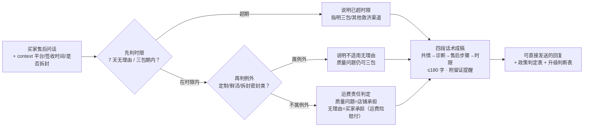

# 退换货政策应答 Return Policy Respond

> 原子技能 ｜ 属于「店铺客服官」 ｜ 电商小卖家客群 ｜ T2 提示词型（纯提示词，无脚本依赖）
>
> **把店铺政策 + 平台规则翻译成买家能懂的答复：谁承担运费、多久到账、下一步怎么操作——该给的权利一条不少，不该承诺的一条不多。**
> 4 步判定顺序（时限 → 例外 → 运费责任 → 到账） · 3 类运费责任划分 · 4 平台差异表 · 依据《消费者权益保护法》第 25 条


🎬 **[▶ 观看演示视频（在线播放）](https://cdn.jsdelivr.net/gh/bangwozuo/shop-support-zh@main/skills/return-policy-respond/docs/assets/demo.mp4) · [GitHub 页](https://github.com/bangwozuo/shop-support-zh/blob/main/skills/return-policy-respond/docs/assets/demo.mp4)** — 四幕创作叙事：业务钩子 → 真实执行 → 要点到成稿演变 → 交付物

*上图来自输出预览 · 实跑产物：把 `prompt.txt` 全量作为系统提示词，对真实输入「保温杯杯盖有划痕，想退货，运费谁出？」的应答结果——判定质量问题且在 7 天内，**来回运费由店铺承担**，24 小时内审核、1–3 个工作日到账。*

---

## 它做什么（先定"能不能退"，再定"谁出运费、多久到账"）

### 一、判定顺序（顺序不能反）

1. **是否在时限内**：网购 **7 天无理由退货**（《消费者权益保护法》第 25 条，自签收次日起 7 天内、商品完好）；三包期内质量问题可修/可换/可退
2. **是否属于无理由例外**：定制商品、鲜活易腐、已拆封数字化商品、报纸期刊；拆封影响二次销售的贴身/密封类（内衣、化妆品、食品等）
3. **运费责任判定**（最易答错）：

| 情形 | 运费承担 |
|---|---|
| 质量问题 / 发错漏发 | **店铺承担**（含退回与重发） |
| 7 天无理由退货 | 买家承担（有运费险按保险赔付） |
| 未按约定时间发货 | 店铺承担 |

4. **退款到账**：审核通过后 **1–3 个工作日**退回原支付渠道（以各平台时效为准）

### 二、平台差异（答复前先认平台）

| 平台 | 无理由时长 | 特色 | 备注 |
|---|---|---|---|
| 淘宝/天猫 | 7 天 | 退货宝、运费险 | 大促价保另计 |
| 抖店 | 7 天 | 官方退货、极速退款 | 以订单页协议为准 |
| 拼多多 | 7 天 | 部分类目「仅退款」 | 商家可申诉 |
| 小红书 | 7 天 | 以店铺售后卡为准 | — |

以上为通用规则，**以平台官方最新公示与店铺售后卡为准**。

## 真实输入 → 真实输出

**输入**（`examples/input.json`）：

```json
{
  "question": "我收到的保温杯杯盖有划痕，想退货，运费谁出？",
  "context": "平台：淘宝；订单 TB20260923011；保温杯 89 元；9 月 25 日签收，今日 9 月 30 日（签收第 5 天，在 7 天内）；杯盖划痕属质量问题；已投保运费险",
  "persona": "店铺售后政策：质量问题包来回运费，支持 7 天无理由，退款审核 24 小时内，到账 1–3 个工作日"
}
```

**输出**（模型按 prompt.txt 执行，节选，完整见 [`examples/output.md`](examples/output.md)）：

> 【AI 生成内容】理解您的心情，杯盖有划痕确实影响体验，我来帮您处理。您这笔订单 TB20260923011 签收第 5 天，在 7 天内；杯盖划痕属于质量问题，**来回运费由我们承担**。您在订单页点「申请售后 → 退货退款」，选原因「质量问题」，上传 1 张杯盖划痕照片即可。我这边 24 小时内审核，通过后退款 1–3 个工作日原路到账。麻烦您先拍张照片留证～

| 项 | 内容 |
|---|---|
| 情形 | 质量问题（杯盖划痕），签收第 5 天仍在 7 天内 |
| 是否可退换 | 可退（质量问题，不受无理由例外限制） |
| 运费责任 | **店铺承担**（来回运费，含退回与重发） |
| 升级判断 | 否（金额 89 元、责任明确，在客服授权内） |

## 处理流水线



## 快速开始

```text
1. 打开 prompt.txt，全文复制
2. 粘贴到 Coze / WorkBuddy / Dify / Claude / ChatGPT
3. 按 schema.json 的输入规格提供：question（必填）+ context / persona（可选）
```

纯提示词资产，无脚本依赖；信息不足时按 prompt 规则列清单让买家补（签收时间、是否拆封、有无照片），不臆测。

## 面向谁 / 什么时候用

| ✅ 该用 | ❌ 别用 |
|---|---|
| 「能不能退 / 运费谁出 / 几天到账」类咨询 | 替店长拍板赔付（超授权只出草稿） |
| 责任明确的质量问题/无理由退货指引 | 「概不退换」类违法表述（法定权利不给免） |
| 多平台店铺的统一口径应答 | 诱导删差评、改好评、撤诉（违规） |

## 边界与合规

- 本资产输出为 **AI 辅助生成内容**，交付前必须人工审核，并按平台要求完成 AI 内容标识
- 只用给定 `context` 判定；信息不足列清单补齐，不臆测；涉及质量先请买家留证
- 不承诺超出平台规则与店铺政策的赔付；不引导站外「私下转账退款」；资金操作只出草稿

## 文件地图

```text
├── README.md      ← 本文件
├── SKILL.md       ← 资产定义（元信息 / 契约 / 边界）
├── prompt.txt     ← 提示词本体（判定顺序 + 平台差异 + 四段话术）
├── schema.json    ← 输入输出契约（机器可读）
├── examples/      ← 真实输入 + 模型实跑输出
└── docs/          ← 9 项配套文档（架构 / 流程 / 场景 / 测试报告…）
```

---

*本资产遵循 [bangwozuo 数字员工资产规范](https://github.com/bangwozuo/digital-employee-spec) v3.0 ｜ [所属员工：店铺客服官](../../) ｜ [总入口](https://github.com/bangwozuo/digital-employees-hub-zh)*
