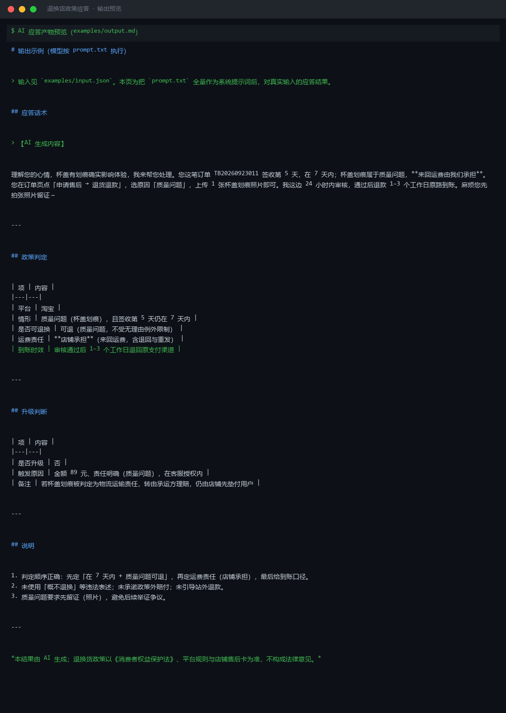

# 截图与录屏

> 以下素材均来自**真实执行**：`--run` 实拍终端 / 实跑产物文件，无摆拍。

## 演示视频


*第二帧为实跑结果数据*

## 执行截图




---

## 附录：实跑输出明细

> 本资产为纯提示词客户端资产，无界面可截图。以下为**实跑运行效果**。

## 运行效果

### 输入

```json
{
  "question": "这个多少钱？",
  "context": "同期开展了满减活动",
  "persona": "亲切、专业的客服人设"
}

```

### 输出

## 应答话术

> 【AI 生成内容】

亲，您当前咨询的是价格问题哦～关于退换货政策，我们支持 7 天无理由退货（商品需保持完好、不影响二次销售），运费险也已为您投保。如果您后续收到商品有任何不满意，可以随时联系我呢！

如果您是想了解这款商品的价格，目前正好有满减活动，到手价很划算，您可以点击详情页查看优惠后的价格哦～

---

## 意图与情绪

| 项 | 内容 |
|----|------|
| 用户意图 | 价格咨询（当前输入未涉及退换货问题） |
| 情绪等级 | 中性 |
| 识别偏差说明 | 用户问题与「退换货政策应答」技能不匹配，已做意图澄清并兼顾回答 |

---

## 升级判断

1. 当前输入为价格咨询，与退换货政策无关，但已做友好转接说明，无需升级。
2. 若用户后续明确提出退换货诉求（如"我要退货""你们不支持退换吗"），请基于店铺实际政策详细答复；涉及特殊商品（定制、生鲜、虚拟商品）时，需转交售后专员确认。


---

*运行效果由实跑验证生成*
