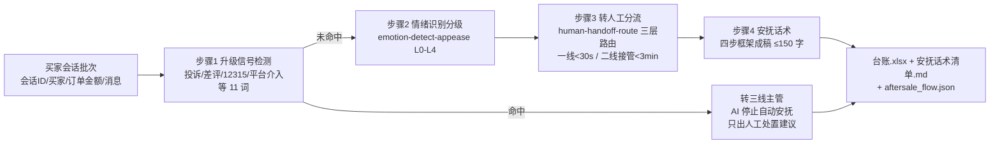

# 售后工单分流与安抚 After-sale Ticket Route Flow

> 工作流（复合技能） ｜ 属于「店铺客服官」 ｜ 电商小卖家客群 ｜ T3 流程编排型（脚本交付真实文件）
>
> **把每一通售后会话变成一条可执行的处置链：升级信号拦截 → 情绪分级 → 三层分流 → 安抚话术 → 汇总台账——命中升级信号即停止一切自动安抚。**
> 编排 2 个原子技能（human-handoff-route / emotion-detect-appease） · 5 步 DAG · 11 词升级信号拦截 · L0–L4 情绪映射话术策略 · SLA 首响 <30 秒 / 接管 <3 分钟 / 售后 24h 给方案


*上图来自真实执行：`python scripts/run_flow.py --demo`，7 条售后会话一次跑完——升级转主管 2 / 可自动安抚 5 / 内容缺失 0，产物落盘台账 Excel + 话术清单 MD + JSON。*

---

## 它做什么（5 步处置链，升级信号优先于一切）

### 分步指令与失败处理

| 步骤 | 技能 | 做什么 | 失败处理 |
|---|---|---|---|
| 1. 升级信号检测 | human-handoff-route（升级词表） | 扫描「投诉/差评/12315/平台介入/工商/消协/曝光/起诉/律师/举报/维权」11 词，命中 → 转三线主管，**跳过自动安抚** | 命中不降级，买家撤回敏感词也不回退 |
| 2. 情绪识别分级 | emotion-detect-appease（L0–L4 口径） | 按词表分级，取命中最高档不累加 | 消息为空 → 标「内容缺失」并入待人工，不猜情绪 |
| 3. 转人工分流 | human-handoff-route（分类树+SLA） | 判定顺序：升级信号 → 情绪 → 分类；三层路由 + 接管时限 | 分类未命中 → 「其他」按二线处理，不强行归类 |
| 4. 安抚话术成稿 | emotion-detect-appease（四步框架） | 按情绪等级取策略，共情→诊断→方案→行动，≤150 字 | 订单金额缺失 → 补偿只写「我去帮您申请」，不出现金额 |
| 5. 汇总交付 | 内置 | 台账 Excel + 话术清单 MD + JSON | 无会话 → 退出码 1，不产出空台账 |

### 情绪 → 安抚策略映射

| 情绪 | 策略 |
|---|---|
| L0 | 直接解答 + 轻共情 |
| L1 | 共情 + 给明确时间点 |
| L2 | 强共情 + 解释 + 授权内补偿选项 |
| L3 | 先道歉认责、只谈解决、不辩解 |
| L4 | 立即致歉转主管留痕 |

## 真实输入 → 真实输出

**输入**（`examples/input.json`，7 条会话）：C-2001 物流催件（L1）、C-2002 质量不满（L2）、C-2003/C-2006 升级信号命中等。

**输出**（脚本实跑，节选）：

| 会话ID | 买家 | 主分类 | 情绪等级 | 分流层级 | 接管时限 | 安抚策略 |
|---|---|---|---|---|---|---|
| C-2001 | 买家A | 物流 | L1 轻微不满 | 一线自助 | AI/自助即时 | 共情 + 给明确时间点 |
| C-2002 | 买家B | 质量 | L2 明显不满 | 二线人工 | < 3 分钟 | 强共情+解释+补偿选项 |
| C-2003 | 买家C | — | — | 三线（主管） | < 3 分钟 | **AI 停止自动安抚，人工处置** |

**话术框架成稿样例**（C-2002，成稿由模型按四步框架补全）：

```text
① 共情（认可情绪）→ ② 诊断（复述「质量」问题确认）
→ ③ 方案（给 1-2 个选项）→ ④ 行动（明确时限：售后问题 24 小时内给方案）
```

完整执行报告见 [`examples/output.md`](examples/output.md)；产物：`out/售后分流安抚台账.xlsx`（分流台账/升级清单/情绪分布）+ `out/安抚话术清单.md` + `out/aftersale_flow.json`。

## 处理流水线（真实 DAG）



## 快速开始

**方式一：脚本（推荐，分类/情绪/路由以脚本输出为准）**

```bash
# 演示模式（内置 7 条真实样例）
python scripts/run_flow.py --demo
# 指定输入
python scripts/run_flow.py --input examples/input.json --outdir out
```

**方式二：纯对话**

```text
1. 打开 prompt.txt，全文复制
2. 粘贴到 AI 工具，按分步指令逐步执行
3. 末步汇总成分流安抚台账 + 话术清单
```

## 面向谁 / 什么时候用

| ✅ 该用 | ❌ 别用 |
|---|---|
| 售后会话批量的分流 + 安抚一体化处置 | 替代主管做赔付审批（升级件必须人工） |
| 升级会话必须拦截自动安抚的场景 | 在自动回复里承诺补偿金额（越权） |
| 夜班/大促坐席的售后先手处置层 | 抓取需登录的私域会话数据 |

## 边界与合规

- 本资产输出为 **AI 辅助生成内容**，交付前必须人工审核，并按平台要求完成 AI 内容标识
- 升级信号命中即停自动安抚，宁升不降；交接摘要只描述事实，不替接管人下结论
- 资金相关操作仅生成草稿，不执行写操作；不泄露买家个人信息

## 文件地图

```text
├── README.md            ← 本文件
├── SKILL.md             ← 资产定义（元信息 / 契约 / 边界）
├── prompt.txt           ← 编排提示词（DAG + 分步指令 + 失败处理）
├── schema.json          ← 输入输出契约（机器可读）
├── scripts/run_flow.py  ← 编排脚本（复用两个原子技能判定逻辑 → Excel/MD/JSON）
├── examples/            ← 真实输入 + 脚本实跑输出
├── docs/                ← 9 项配套文档（架构 / 流程 / 场景 / 测试报告…）
└── out/                 ← 实跑产物（售后分流安抚台账.xlsx / 安抚话术清单.md / aftersale_flow.json）
```

---

*本资产遵循 [bangwozuo 数字员工资产规范](https://github.com/bangwozuo/digital-employee-spec) v3.0 ｜ [所属员工：店铺客服官](../../) ｜ [总入口](https://github.com/bangwozuo/digital-employees-hub-zh)*
