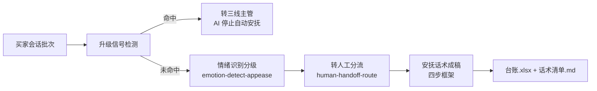

# 售后工单分流与安抚

按固定 DAG 编排，完成「情绪识别 → 分级 → 安抚话术/转人工」的端到端流程。触发方式：事件。

## 元信息

| 字段 | 值 |
|------|-----|
| ID | `de_ecom_02_wf03` |
| 类型 | **`composite`（复合技能）** |
| 所属员工 | 店铺客服官 |
| 阶段 | `P0` |
| 复杂度 | `M` |
| 触发方式 | 事件 |
| ROI | 拦截情绪波动致差评 |
| 资产形态 | 纯提示词 + 可跑编排脚本（无模型调用、无 API Key） |

## 能力描述

对每通售后会话先做升级信号拦截（命中即转三线主管、停止自动安抚），再做 L0-L4 情绪分级与三层分流（一线自助/二线人工/三线主管），最后按情绪等级映射安抚策略、生成四步话术成稿与分流台账。

## 编排的原子技能

| # | 原子技能 | 能力 |
|---|---------|------|
| 1 | [情绪识别安抚](../../skills/emotion-detect-appease/) | 情绪分级 + 降温话术 |
| 2 | [转人工分流](../../skills/human-handoff-route/) | 边界判断 + 摘要交接 |

## 步骤链路（DAG）



## 步骤明细

| # | 步骤 | 技能资产 | 输入 | 处理 | 输出 | 失败处理 |
|---|------|---------|------|------|------|---------|
| 1 | 升级信号检测 | `human-handoff-route`（升级词表） | 会话批次 | 扫描「投诉/差评/12315/平台介入/工商/消协/曝光/起诉/律师/举报/维权」 | 升级清单 | 命中即停自动安抚，只出交接摘要 |
| 2 | 情绪识别分级 | `../../skills/emotion-detect-appease/` | 买家消息 | L0-L4 词表分级，取最高档 | 情绪等级 | 消息为空→标内容缺失并入待人工 |
| 3 | 转人工分流 | `../../skills/human-handoff-route/` | 分类+情绪+信号 | 三层路由（先信号→再情绪→后分类） | 层级+SLA+交接摘要 | 分类未命中→「其他」走二线 |
| 4 | 安抚话术成稿 | `aftersale-ticket-route-flow`（内置） | 分流台账 | 四步框架：共情→诊断→方案→行动，≤150 字 | 可发送话术 | 金额缺失→不给补偿金额 |
| 5 | 汇总交付 | `aftersale-ticket-route-flow`（内置） | 上一步输出 | 汇总台账+话术清单 | 台账.xlsx + 话术清单.md | — |

## 输入规格

| 字段 | 类型 | 必填 | 说明 |
|------|------|------|------|
| `conversations` | array | ✅ | 会话数组（会话ID/买家/订单金额/消息[]） |
| `shop` | string | ⬜ | 店铺名，用于报告抬头 |
| `now` | string | ⬜ | 基准时间 `YYYY-MM-DD HH:MM` |

## 输出规格

| 字段 | 类型 | 说明 |
|------|------|------|
| `summary` | object | 会话总数 / 升级转主管 / 可自动安抚 / 内容缺失 / 情绪分布 |
| `steps` | array | 分步结果（含失败处理） |
| `deliverable` | string | 端到端交付物：售后分流安抚台账.xlsx + 安抚话术清单.md |

## 错误处理

| 情况 | 处理方式 |
|------|---------|
| 缺 `conversations` | 打印 error 并退出码 1，不产出空台账 |
| 升级信号命中 | 转三线主管，AI 停止自动安抚，不做降级 |
| 消息内容为空 | 标「内容缺失」并入待人工，不猜测情绪 |
| 订单金额缺失 | 补偿选项只写「我去帮您申请」，不出现金额 |

## 使用步骤

### 方式一：纯提示词

把 `prompt.txt` 全量粘贴为系统提示词，提供 `conversations` 数组。

### 方式二：带脚本（真编排 + 产物）

```bash
python <SKILL_DIR>/scripts/run_flow.py --input input.json --outdir out
python <SKILL_DIR>/scripts/run_flow.py --demo
```

产物：`out/售后分流安抚台账.xlsx`、`out/安抚话术清单.md`、`out/aftersale_flow.json`。

## 边界（不做的事）

- ❌ 编造数据、案例或效果承诺
- ❌ 不把命中升级信号的会话留在二线
- ❌ 不承诺无法兑现的赔付；资金操作只出草稿
- ❌ 不生成诱导好评、删差评等违规内容
- ❌ 不涉及资金操作或代替主管做最终决策

## 调用示例

**输入**（`examples/input.json` 节选）：

```json
{"会话ID": "C-2003", "买家": "买家C", "订单金额": 1299,
 "消息": [{"角色": "买家", "内容": "耳机左耳没声音，我要退款，再不解决我就投诉到12315！"}]}
```

**输出**（实跑，7 条会话：升级 2 / 可自动安抚 5）：

| 会话ID | 主分类 | 情绪等级 | 分流层级 | 安抚策略 |
|---|---|---|---|---|
| C-2001 | 物流 | L1 轻微不满 | 一线自助 | 共情+给明确时间点 |
| C-2002 | 质量 | L2 明显不满 | 二线人工 | 强共情+解释+补偿选项 |
| C-2003 | 质量 | L4 | 三线（主管） | 升级信号：投诉、12315 |
| C-2005 | 其他 | L4 极端/威胁 | 三线（主管） | 升级信号：差评、曝光 |

## 所属工作流

本资产为复合技能（工作流），是独立的端到端流程。

## 合规声明

- 本技能输出为 **AI 辅助生成内容**，交付前必须经人工/主管确认
- 涉及赔付、纠纷处置的话术须经主管签字；资金相关仅出草稿
- 分流台账含买家会话隐私，仅限客服团队内部使用

---

*本复合技能定义由 build_p0_assets.py 生成*
