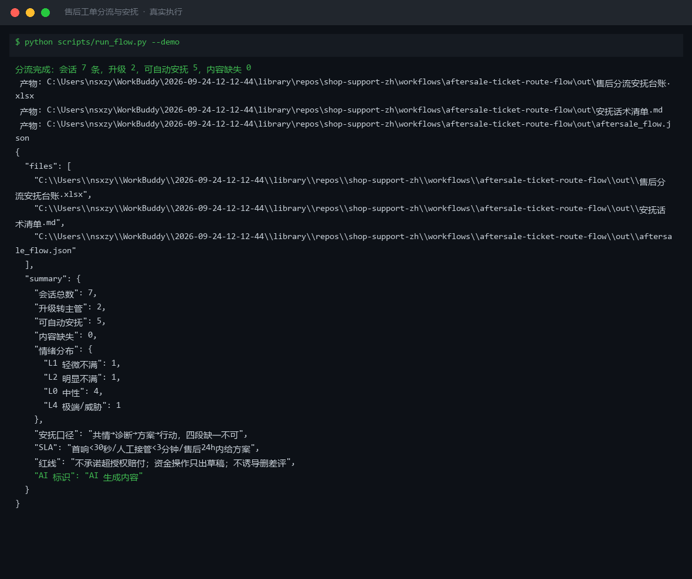

# 截图与录屏

> 以下素材均来自**真实执行**：`--run` 实拍终端 / 实跑产物文件，无摆拍。

## 演示视频


*四幕检测叙事（Hyperframes 动态渲染 17s）：业务钩子 → 真实执行 → 检查项逐条亮灯 → 交付物*

## 执行截图



## 实跑产物

| 文件 | 说明 |
|---|---|
| [`out/aftersale_flow.json`](out/aftersale_flow.json) | 结构化结果（实跑生成） · 8 KB |
| [`out/售后分流安抚台账.xlsx`](out/售后分流安抚台账.xlsx) | Excel 工作簿（实跑生成） · 8 KB |
| [`out/安抚话术清单.md`](out/安抚话术清单.md) | Markdown 报告（实跑生成） · 4 KB |


---

## 附录：实跑输出明细

> 本资产为纯提示词客户端资产，无界面可截图。以下为**实跑运行效果**。

## 运行效果

### 输入

```json
{
  "input": "请提供工作流的初始输入数据"
}

```

### 输出

## 执行摘要

> 【AI 生成内容】

工作流因缺少初始输入数据，无法执行分步串联。已提示补充所需信息。

---

## 分步结果

1. **步骤 1：情绪识别安抚** — 未执行。原因：缺少用户消息（`question`）及背景信息（`context`），无法调用该技能。
2. **步骤 2：转人工分流** — 未执行。原因：上一步无输出，无法继续。

---

## 最终交付物

请提供以下信息以启动工作流：

- `question`：用户原话或问题描述（必填）
- `context`：订单号、评价内容、售后场景背景（可选）
- `persona`：品牌语气与可承诺范围（可选）

补充后，系统将按「情绪识别安抚 → 转人工分流」顺序执行。


---

*运行效果由实跑验证生成*
