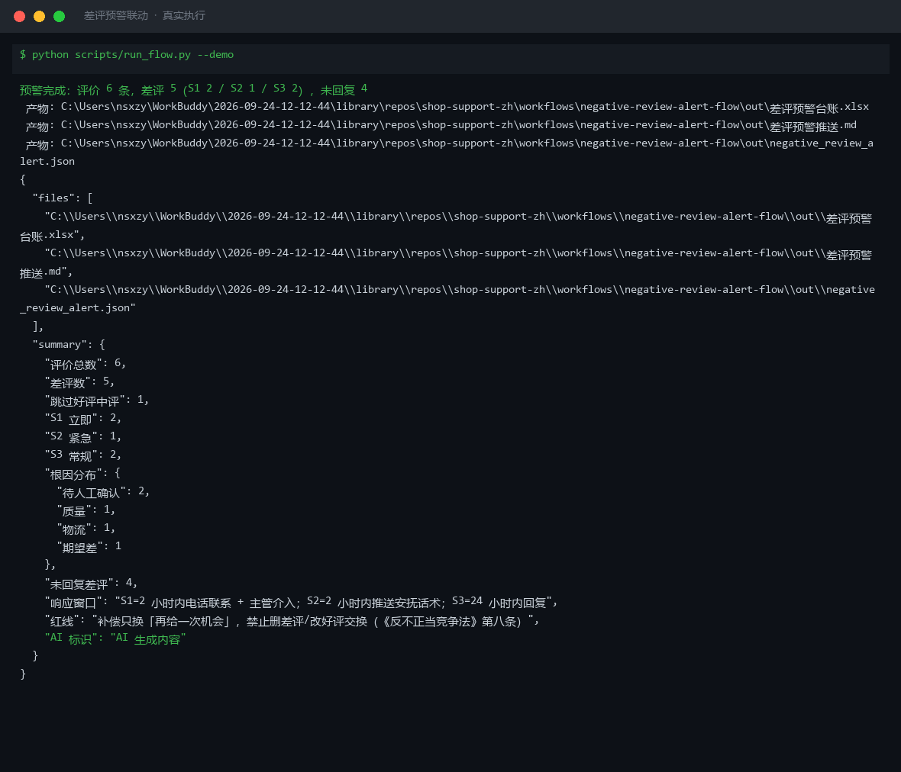
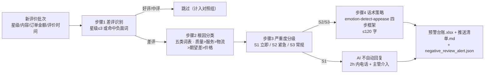

# 差评预警联动 Negative Review Alert Flow

> 工作流（复合技能） ｜ 属于「店铺客服官」 ｜ 电商小卖家客群 ｜ T3 流程编排型（脚本交付真实文件）
>
> **把每一条新评价变成带时限的处置任务：S1 立即电话+主管、S2 紧急推话术、S3 常规 24h 回复——差评回复率 100% 是硬指标。**
> 5 步 DAG · 五类根因词表（质量>服务>物流>期望差>价格） · 三级严重度响应窗口（S1 2h / S2 2h / S3 24h） · 食安类词直判 S1




*上图来自真实执行：`python scripts/run_flow.py --demo`，6 条评价一次跑完——差评 5（S1 立即 2 / S2 紧急 1 / S3 常规 2），未回复 4，产物落盘预警台账 Excel + 推送清单 MD + JSON。*

---

## 它做什么（识别 → 定因 → 定级 → 定话术 → 推送）

### 三级严重度与响应窗口（脚本判定）

| 档位 | 触发条件 | 响应窗口 | 处置动作 |
|---|---|---|---|
| **S1 立即** | 命中 12315/媒体/曝光/律师/起诉/工商/消协/举报/维权，或食安类词（食物中毒/拉肚子/变质/发霉/异物），或情绪 ≥L3 | **2 小时内** | 电话联系 + 主管介入，**AI 不自动回复**，留存证据并向平台报备 |
| **S2 紧急** | 情绪 = L2，或主根因 = 质量，或差评超 24h 未回复 | **2 小时内** | 推送安抚话术，店主确认后回复 |
| **S3 常规** | 其余差评 | **24 小时内** | 回复处理；差评回复率 100% 为硬指标 |

### 五类根因词表（多重命中按优先序取主根因）

| 优先序 | 根因 | 词表示例 |
|---|---|---|
| 1 | 质量 | 破损、色差、故障、没声音、鼓包 |
| 2 | 服务 | 态度、敷衍、爱答不理 |
| 3 | 物流 | 超时、丢件、未发货、超区 |
| 4 | 期望差 | 与图片实物不符、夸大宣传 |
| 5 | 价格 | 贵了、不值、涨价、买贵 |

五类全未命中（如纯情绪「再也不买了」）→ 根因标「待人工确认」，话术只给「私信了解情况」，不给补偿金额。

## 真实输入 → 真实输出

**输入**（`examples/input.json`，6 条评价）：R-9001 命中维权词、R-9002 质量问题情绪 L3、R-9003 物流太慢 L2、R-9004 与图片不符、R-9005 好评（对照组）、R-9006 纯情绪。

**输出**（脚本实跑，节选）：

| 评价ID | 严重度 | 主根因 | 情绪 | 响应窗口 | 话术策略 |
|---|---|---|---|---|---|
| R-9001 | S1 立即 | 待人工确认 | L0 中性 | 2 小时内电话联系 + 主管介入 | AI 不自动回复 |
| R-9002 | S1 立即 | 质量 | L3 愤怒 | 2 小时内电话联系 + 主管介入 | 先道歉认责、只谈解决 |
| R-9003 | S2 紧急 | 物流 | L2 明显不满 | 2 小时内推送安抚话术 | 强共情+解释+授权内补偿选项 |
| R-9004 | S3 常规 | 期望差 | L0 中性 | 24 小时内回复 | 直接解答+轻共情 |

完整执行报告（含 S1 立即处置清单、店主待确认动作）见 [`examples/output.md`](examples/output.md)；产物：`out/差评预警台账.xlsx`（预警台账/S1 立即处置/根因分布）+ `out/差评预警推送.md` + `out/negative_review_alert.json`。

## 处理流水线（真实 DAG）



## 快速开始

**方式一：脚本（推荐，识别/根因/严重度/情绪以脚本输出为准）**

```bash
# 演示模式（内置 6 条真实样例）
python scripts/run_flow.py --demo
# 指定输入
python scripts/run_flow.py --input examples/input.json --outdir out
```

**方式二：纯对话**

```text
1. 打开 prompt.txt，全文复制
2. 粘贴到 AI 工具，按分步指令逐步执行
3. 末步汇总成预警推送清单
```

## 面向谁 / 什么时候用

| ✅ 该用 | ❌ 别用 |
|---|---|
| 每日新评价巡检，S1 风险第一时间电话处置 | AI 自动回复 S1 升级差评（禁止，须主管） |
| 差评根因统计，反哺选品与物流改进 | 诱导买家删差评、改好评（违规） |
| 差评回复率 100% 的店铺硬指标管理 | 抓取需登录的私域评价数据 |

## 边界与合规

- 本资产输出为 **AI 辅助生成内容**，交付前必须人工审核，并按平台要求完成 AI 内容标识
- S1 信号命中即停一切自动回复；评价时间缺失按立即响应处理并标注，不按超时估算
- 订单金额缺失 → 补偿只写「我去帮您申请」；资金相关仅草稿，不执行写操作

## 文件地图

```text
├── README.md            ← 本文件
├── SKILL.md             ← 资产定义（元信息 / 契约 / 边界）
├── prompt.txt           ← 编排提示词（DAG + 五类词表 + 严重度规则）
├── schema.json          ← 输入输出契约（机器可读）
├── scripts/run_flow.py  ← 编排脚本（复用 human-handoff-route 情绪判定 → Excel/MD/JSON）
├── examples/            ← 真实输入 + 脚本实跑输出
├── docs/                ← 9 项配套文档（架构 / 流程 / 场景 / 测试报告…）
└── out/                 ← 实跑产物（差评预警台账.xlsx / 差评预警推送.md / negative_review_alert.json）
```

---

*本资产遵循 [bangwozuo 数字员工资产规范](https://github.com/bangwozuo/digital-employee-spec) v3.0 ｜ [所属员工：店铺客服官](../../) ｜ [总入口](https://github.com/bangwozuo/digital-employees-hub-zh)*
