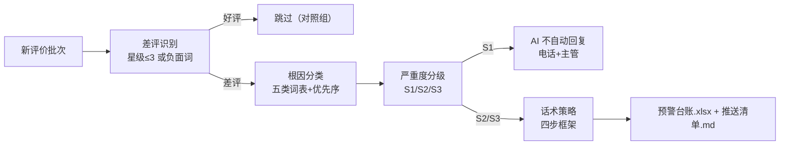

# 差评预警联动

按固定 DAG 编排，完成「情感分析 → 安抚话术推送店主」的端到端预警。触发方式：事件（新评价）。

## 元信息

| 字段 | 值 |
|------|-----|
| ID | `de_ecom_02_wf05` |
| 类型 | **`composite`（复合技能）** |
| 所属员工 | 店铺客服官 |
| 阶段 | `P1` |
| 复杂度 | `S` |
| 触发方式 | 事件（新评价） |
| ROI | 与售后分流共享链路，零增量成本 |
| 资产形态 | 纯提示词 + 可跑编排脚本（无模型调用、无 API Key） |

## 能力描述

对新评价批次做差评识别（星级≤3 或负面词）、五类根因分类、S1/S2/S3 三级严重度分级与情绪 L0-L4 判定，产出按严重度排序的预警推送清单：S1 命中（12315/食安/愤怒）即停自动回复转电话+主管，S2 在 2 小时内推送安抚话术，S3 在 24 小时内回复，回复率目标 100%。

## 编排的原子技能

| # | 原子技能 | 能力 |
|---|---------|------|
| 1 | [转人工分流](../../skills/human-handoff-route/) | 情绪分级 L0-L4 + 升级信号词表（脚本复用） |
| 2 | [情绪识别安抚](../../skills/emotion-detect-appease/) | 四步话术框架（共情→诊断→方案→行动） |

## 步骤链路（DAG）



## 步骤明细

| # | 步骤 | 技能资产 | 输入 | 处理 | 输出 | 失败处理 |
|---|------|---------|------|------|------|---------|
| 1 | 差评识别 | `negative-review-alert-flow`（内置） | 评价数组 | 星级≤3 或负面词命中 | 差评批次 | 星级缺失→负面词兜底 |
| 2 | 根因分类 | `negative-review-alert-flow`（内置词表） | 差评文本 | 五类词表，质量>服务>物流>期望差>价格 | 主根因+证据 | 全未命中→待人工确认 |
| 3 | 严重度分级 | `../../skills/human-handoff-route/`（情绪，脚本复用） | 根因+情绪+时间 | S1 立即/S2 紧急/S3 常规 | 响应窗口 | 时间缺失→按立即响应 |
| 4 | 话术成稿 | `../../skills/emotion-detect-appease/`（口径） | 预警台账 | 四步框架，≤120 字 | 可发送话术 | 金额缺失→不给金额 |
| 5 | 推送汇总 | `negative-review-alert-flow`（内置） | 上一步输出 | 按严重度排序 | 台账.xlsx + 推送清单.md | — |

## 输入规格

| 字段 | 类型 | 必填 | 说明 |
|------|------|------|------|
| `reviews` | array | ✅ | 评价数组（评价ID/平台/星级/内容/订单金额/评价时间/回复状态/订单号） |
| `shop` | string | ⬜ | 店铺名 |
| `now` | string | ⬜ | 基准时间 `YYYY-MM-DD HH:MM`，用于算评价年龄 |

## 输出规格

| 字段 | 类型 | 说明 |
|------|------|------|
| `summary` | object | 评价总数/差评数/S1·S2·S3 计数/根因分布/未回复差评 |
| `steps` | array | 分步结果（含失败处理） |
| `deliverable` | string | 端到端交付物：差评预警台账.xlsx + 差评预警推送.md |

## 错误处理

| 情况 | 处理方式 |
|------|---------|
| 缺 `reviews` | 打印 error 并退出码 1，不产出空台账 |
| S1 信号命中 | AI 不自动回复，2 小时内电话+主管介入 |
| 五类词表全未命中 | 根因标「待人工确认」，话术只给「私信了解情况」 |
| 评价时间缺失 | 标「时间缺失」，按立即响应处理 |

## 使用步骤

### 方式一：纯提示词

把 `prompt.txt` 全量粘贴为系统提示词，提供 `reviews` 数组。

### 方式二：带脚本（真编排 + 产物）

```bash
python <SKILL_DIR>/scripts/run_flow.py --input input.json --outdir out
python <SKILL_DIR>/scripts/run_flow.py --demo
```

产物：`out/差评预警台账.xlsx`、`out/差评预警推送.md`、`out/negative_review_alert.json`。

## 边界（不做的事）

- ❌ 不做删差评/改好评交换（《反不正当竞争法》第八条）
- ❌ 不碰 S1 信号——命中即停自动回复
- ❌ 不在公开回复区承诺退款金额
- ❌ 不编造整改动作或效果承诺
- ❌ 不承诺超出响应窗口的时限

## 调用示例

**输入**（`examples/input.json` 节选）：

```json
{"评价ID": "R-9001", "平台": "淘宝", "星级": 1,
 "内容": "充电宝用了一周就鼓包了，太吓人了，再不处理我就打12315",
 "订单金额": 129, "评价时间": "2026-09-30 08:10", "回复状态": "未回复"}
```

**输出**（实跑，6 条评价：差评 5 = S1×2 / S2×1 / S3×2，未回复 4）：

| 评价ID | 严重度 | 主根因 | 情绪 | 响应窗口 |
|---|---|---|---|---|
| R-9001 | S1 立即 | 质量 | L3 愤怒 | 2 小时内电话联系+主管介入 |
| R-9002 | S1 立即 | 质量 | L3 愤怒 | 2 小时内电话联系+主管介入 |
| R-9004 | S2 紧急 | 期望差 | L0 中性 | 2 小时内推送安抚话术 |
| R-9003 | S3 常规 | 物流 | L1 轻微不满 | 24 小时内回复（已回） |

## 所属工作流

本资产为复合技能（工作流），是独立的端到端流程。

## 合规声明

- 本技能输出为 **AI 辅助生成内容**，对外回复发布前经店主确认
- 补偿涉及资金仅出方案草稿；S1 事件人工与法务优先
- 禁止删差评/改好评交换；平台评价规范以官方最新公示为准

---

*本复合技能定义由 build_p0_assets.py 生成*
