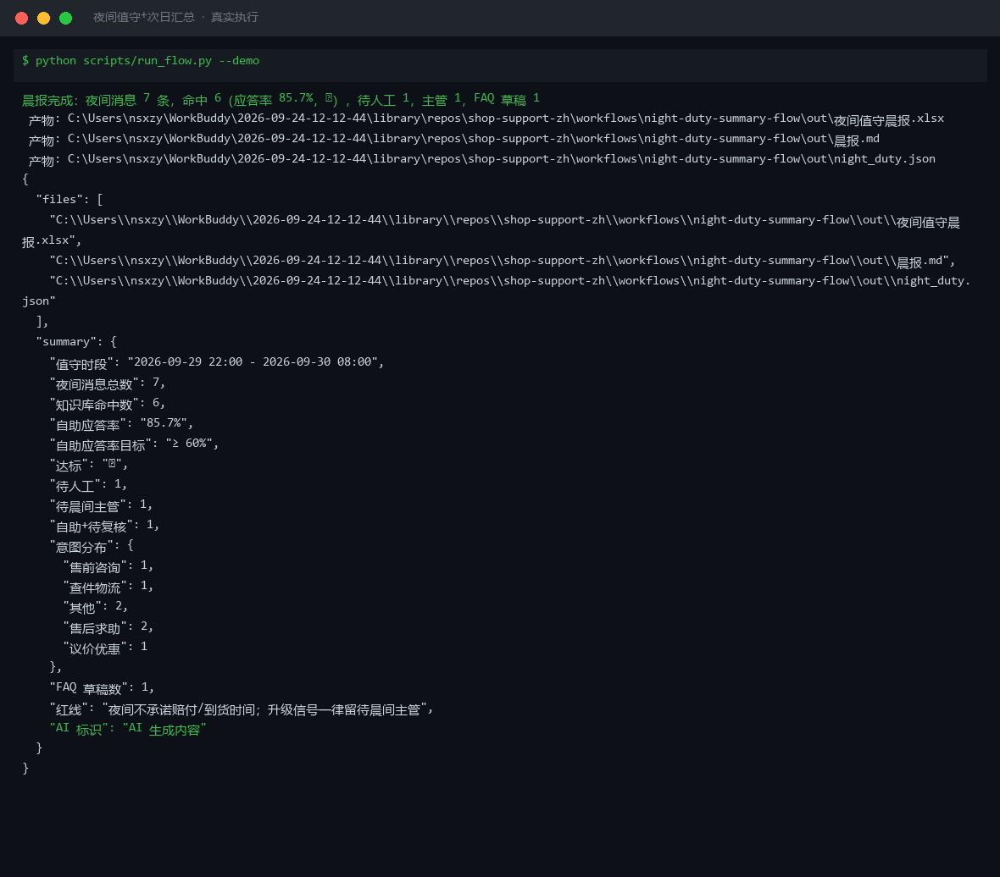
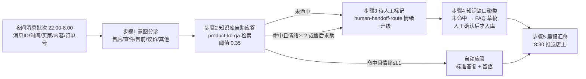

# 夜间值守+次日汇总 Night Duty Summary Flow

> 工作流（复合技能） ｜ 属于「店铺客服官」 ｜ 电商小卖家客群 ｜ T3 流程编排型（脚本交付真实文件）
>
> **夜间 22:00–8:00 无人值守时，让每条深夜消息都得到体面处理：知识库自助应答 + 敏感消息留待晨间主管 + 8:30 晨报推送。**
> 编排 2 个原子技能（product-kb-qa 检索 / human-handoff-route 情绪升级） · 5 步 DAG · 自助应答率目标 ≥60% · FAQ 草稿必须人工确认后入库



🎬 **[▶ 观看演示视频](docs/assets/demo.mp4)** — 四幕数据叙事：业务钩子 → 真实执行 → 指标条形图生长 → 交付物

*上图来自真实执行：`python scripts/run_flow.py --demo`，7 条夜间消息一次跑完——知识库命中 6，自助应答率 **85.7%**（目标 ≥60% ✅），待人工 1 / 待晨间主管 1 / FAQ 草稿 1。*

---

## 它做什么（分诊 → 自助应答 → 留痕 → 聚缺口 → 晨报）

### 分步指令与失败处理

| 步骤 | 技能 | 做什么 | 失败处理 |
|---|---|---|---|
| 1. 夜间消息分诊 | 内置意图词表 | 自上而下先急后缓：售后求助 → 查件物流 → 售前咨询 → 议价优惠 → 其他 | 全部未命中 → 「其他」，不强行归类 |
| 2. 知识库自助应答 | product-kb-qa（kb_qa.retrieve 复用） | 打分公式 `0.55×标签 + 0.45×bigram Jaccard`，阈值 0.35，命中取标准答复 | kb 缺失 → 全部标「知识库缺失」，**不产出假答复** |
| 3. 待人工标记 | human-handoff-route（情绪+升级） | 三种进清单：① 未命中 → 待人工；② 命中「投诉/差评/12315/平台介入/报警」→ 待晨间主管，**夜间不自动回复**；③ 命中但情绪 ≥L2 或售后求助 → 自助+待复核 | 消息为空 → 标「内容缺失」，不猜意图 |
| 4. 知识缺口聚类 | 内置 + 模型润色 | 未命中问题按意图聚成 FAQ 草稿（类目+问题+建议口径） | **草稿必须人工确认口径后才入库，不自动生效** |
| 5. 晨报汇总 | 内置 | 命中数、自助应答率（<60% 晨报标黄）、待处理计数、意图分布、FAQ 数 | 无消息 → 退出码 1，不产出空晨报 |

**接管时限**：待晨间主管的消息 **8:30 前**由主管接管。

## 真实输入 → 真实输出

**输入**（`examples/input.json`）：7 条 22:00–8:00 时段消息（N-001 续航咨询、N-004「音箱是坏的没声音，我要退款，不然就投诉了」、N-005「可以刻字定制吗」等）+ kb 知识库条目。

**输出**（脚本实跑，节选）：

| 消息ID | 买家消息 | 处置 | 次日动作 |
|---|---|---|---|
| N-004 | 收到的音箱是坏的没声音，我要退款，不然就投诉了 | **待晨间主管** | 夜间不自动回复敏感内容；主管 8:30 前接管 |
| N-005 | 可以刻字定制吗 | 待人工 | 未命中不硬答；进 FAQ 草稿，晨间人工补答 |
| 其余 5 条 | 参数/物流/优惠类咨询 | 自动应答 | 命中条目 ID + 匹配度，晨报留痕 |

**晨报摘要**：夜间消息 7 条 ｜ 知识库命中 6 ｜ 自助应答率 85.7%（✅ 达标）｜ 待人工 1 ｜ 待晨间主管 1 ｜ 自助+待复核 1 ｜ FAQ 草稿 1。

完整晨报见 [`examples/output.md`](examples/output.md)；产物：`out/夜间值守晨报.xlsx`（值守明细/待人工清单/FAQ 草稿/汇总）+ `out/晨报.md` + `out/night_duty.json`。

## 处理流水线（真实 DAG）



## 快速开始

**方式一：脚本（推荐，意图/命中/情绪/路由以脚本输出为准）**

```bash
# 演示模式（内置 7 条真实样例 + 知识库）
python scripts/run_flow.py --demo
# 指定输入
python scripts/run_flow.py --input examples/input.json --outdir out
```

**方式二：纯对话**

```text
1. 打开 prompt.txt，全文复制
2. 粘贴到 AI 工具，按分步指令逐步执行
3. 末步汇总成晨报
```

## 面向谁 / 什么时候用

| ✅ 该用 | ❌ 别用 |
|---|---|
| 夜间 22:00–8:00 无人值守的承接 | 夜间自动回复敏感/升级消息（一律留晨间） |
| 次日晨会要一份值守汇总与 FAQ 缺口 | FAQ 草稿跳过人工确认直接入库（口径错比没有更糟） |
| 自助应答率 ≥60% 的运营指标管理 | 承诺知识库外的发货/赔付时限 |

## 边界与合规

- 本资产输出为 **AI 辅助生成内容**，交付前必须人工审核，并按平台要求完成 AI 内容标识
- 命中升级触发词的消息夜间一律不自动回复；自助应答率低于 60% 晨报标黄告警
- 知识库缺失时不产出假答复；资金相关仅草稿，不执行写操作

## 文件地图

```text
├── README.md            ← 本文件
├── SKILL.md             ← 资产定义（元信息 / 契约 / 边界）
├── prompt.txt           ← 编排提示词（DAG + 分步指令 + 晨报口径）
├── schema.json          ← 输入输出契约（机器可读）
├── scripts/run_flow.py  ← 编排脚本（复用 kb_qa.retrieve 与情绪升级判定 → Excel/MD/JSON）
├── examples/            ← 真实输入 + 脚本实跑输出
├── docs/                ← 9 项配套文档（架构 / 流程 / 场景 / 测试报告…）
└── out/                 ← 实跑产物（夜间值守晨报.xlsx / 晨报.md / night_duty.json）
```

---

*本资产遵循 [bangwozuo 数字员工资产规范](https://github.com/bangwozuo/digital-employee-spec) v3.0 ｜ [所属员工：店铺客服官](../../) ｜ [总入口](https://github.com/bangwozuo/digital-employees-hub-zh)*
