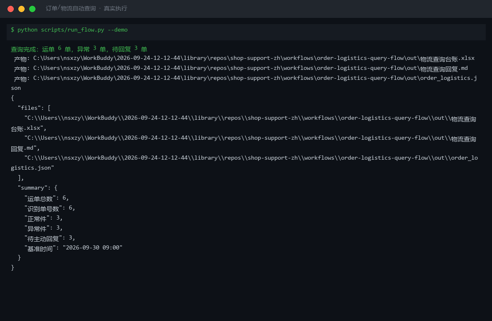
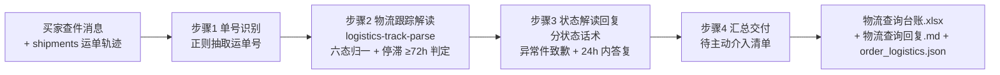

# 订单/物流自动查询 Order Logistics Query Flow

> 工作流（复合技能） ｜ 属于「店铺客服官」 ｜ 电商小卖家客群 ｜ T3 流程编排型（脚本交付真实文件）
>
> **端到端查件：从买家消息识别运单号 → 解析轨迹 → 生成可直接发送的回复 → 汇总「待主动介入」清单——不查库、不猜轨迹。**
> 编排 1 个原子技能（logistics-track-parse） + 3 个内置步骤 · 4 步 DAG · 六态归一 · 异常件自动转主动介入话术（24h 内答复）



🎬 **[▶ 观看演示视频](docs/assets/demo.mp4)** — 四幕创作叙事：业务钩子 → 真实执行 → 要点到成稿演变 → 交付物

*上图来自真实执行：`python scripts/run_flow.py --demo`，4 个运单一次跑完——正常件 1 / 异常件 3，待主动回复 3，基准时间 2026-09-30 09:00，产物落盘台账 Excel + 回复 MD + JSON。*

---

## 它做什么（4 步 DAG，严格按序）

| 步 | 技能 | 处理 | 失败处理 |
|---|---|---|---|
| 1 | 内置：单号识别 | 正则从买家消息抽取运单号（无单号时用 shipments 自带） | 识别不到 → 追问，不猜测 |
| 2 | `logistics-track-parse` | 六态归一化（待揽收/已揽收/运输中/派件中/已签收/异常件）、算停滞、挑异常 | 无轨迹 → 标「无轨迹」，提示核对单号 |
| 3 | 内置：状态解读回复 | 按状态取话术；异常件加前缀致歉并承诺 24 小时内答复 | 异常件统一走主动介入话术 |
| 4 | 内置：汇总交付 | 台账（Excel）+ 回复（Markdown）+ JSON | — |

### 量化口径（数值以脚本输出为准）

- 停滞小时 = `now − 最后事件时间`，保留 0.1 小时
- 异常判定：非已签收且停滞 ≥ **72h** → 「超 72 小时无更新」；命中退回/拒收/滞留/超区/丢失 → 「轨迹异常」
- 分状态话术：待揽收 → 48h 内揽收；派件中 → 留意电话；已签收 → 先核门卫/驿站；异常件 → 24h 内答复

## 真实输入 → 真实输出

**输入**（`examples/input.json`）：4 个运单（顺丰/圆通/中通/京东物流）+ 买家查件原话。

**输出**（脚本实跑，节选）：

| 项 | 内容 |
|---|---|
| 运单总数 / 识别单号数 | 4 / 4 |
| 正常件 / 异常件 | 1 / 3 |
| 待主动回复 | 3 |
| 基准时间 | 2026-09-30 09:00 |

| 步骤 | 技能 | 状态 | 输出 |
|---|---|---|---|
| 1. 单号识别 | order-logistics-query-flow（内置） | ok | 识别 4 个运单号 |
| 2. 物流跟踪解读 | logistics-track-parse | ok | 解析 4 单，异常 3 单 |
| 3. 状态解读回复 | order-logistics-query-flow（内置） | ok | 生成 4 条回复话术 |
| 4. 汇总交付 | order-logistics-query-flow（内置） | ok | 查询台账 + 回复 |

完整运单解读与回复话术见 [`examples/output.md`](examples/output.md)；产物：`out/物流查询台账.xlsx` + `out/物流查询回复.md` + `out/order_logistics.json`。

## 处理流水线（真实 DAG）



## 快速开始

**方式一：脚本（推荐，状态/停滞/异常以脚本输出为准）**

```bash
# 演示模式（内置 4 单真实样例）
python scripts/run_flow.py --demo
# 指定输入
python scripts/run_flow.py --input examples/input.json --outdir out
```

**方式二：纯对话**

```text
1. 打开 prompt.txt，全文复制
2. 粘贴到 AI 工具，按 DAG 严格按序执行
3. 末步汇总成查询台账 + 回复
```

## 面向谁 / 什么时候用

| ✅ 该用 | ❌ 别用 |
|---|---|
| 「我的快递到哪了」的端到端自动应答 | 现场查承运方接口（只解析给定轨迹事件） |
| 批量查件后挑出待主动介入的异常件 | 承诺知识库/轨迹外的到货时间（不编「明天到」） |
| 异常件的主动回复与 24h 时限管理 | 把「无轨迹」直接判丢件（须承运方出险） |

## 边界与合规

- 本资产输出为 **AI 辅助生成内容**，交付前必须人工审核，并按平台要求完成 AI 内容标识
- 不查库、不猜轨迹，一切以运单事件与原子技能输出为准；买家地址/手机号脱敏后输出
- 涉及丢件、赔付、改址的答复模板须经人工确认；资金相关仅草稿，不执行写操作

## 文件地图

```text
├── README.md            ← 本文件
├── SKILL.md             ← 资产定义（元信息 / 契约 / 边界）
├── prompt.txt           ← 编排提示词（DAG + 步骤契约 + 量化口径）
├── schema.json          ← 输入输出契约（机器可读）
├── scripts/run_flow.py  ← 编排脚本（复用 logistics-track-parse → Excel/MD/JSON）
├── examples/            ← 真实输入 + 脚本实跑输出
├── docs/                ← 9 项配套文档（架构 / 流程 / 场景 / 测试报告…）
└── out/                 ← 实跑产物（物流查询台账.xlsx / 物流查询回复.md / order_logistics.json）
```

---

*本资产遵循 [bangwozuo 数字员工资产规范](https://github.com/bangwozuo/digital-employee-spec) v3.0 ｜ [所属员工：店铺客服官](../../) ｜ [总入口](https://github.com/bangwozuo/digital-employees-hub-zh)*
