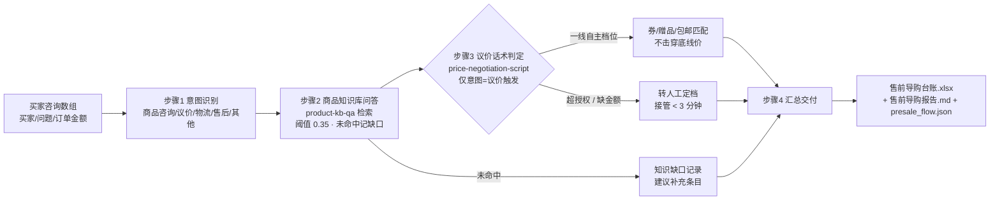

# 售前智能导购 Presale Guide Flow

> 工作流（复合技能） ｜ 属于「店铺客服官」 ｜ 电商小卖家客群 ｜ T3 流程编排型（脚本交付真实文件）
>
> **端到端售前接待：意图分流 → 知识库内作答 → 议价诉求按授权档位匹配让步 → 汇总导购台账——不改口径、不编知识、不越权让价。**
> 编排 2 个原子技能（product-kb-qa / price-negotiation-script） + 2 个内置步骤 · 4 步 DAG · 五类意图 · 三档让步授权 · SLA 首响 <30 秒 / 转人工接管 <3 分钟


*上图来自真实执行：`python scripts/run_flow.py --demo`，6 条买家咨询一次跑完——知识命中 4 / 缺口 2（命中率 66.7%），议价 2 条已配让步档位，产物落盘导购台账 Excel + 报告 MD + JSON。*

---

## 它做什么（4 步 DAG，严格按序不跳步）

| 步 | 技能 | 处理 | 失败处理 |
|---|---|---|---|
| 1 | 内置：意图识别 | 词表判意图：商品咨询 / 议价 / 物流 / 售后 / 其他 | 无法归类 → 标「其他」，不阻断后续 |
| 2 | `product-kb-qa` | 打分检索（`0.55×标签 + 0.45×bigram`），阈值 0.35，输出命中答复 + 置信度 | 未命中 → 记知识缺口，**不编答案** |
| 3 | `price-negotiation-script` | 仅对意图=议价的记录触发；按金额档位匹配让步 | 缺金额 → 标「未知金额」，转人工定档 |
| 4 | 内置：汇总交付 | 合并字段 → 导购台账（Excel）+ 报告（Markdown） | 单步失败 → 保留已完成步骤并标注 |

### 让步档位与置信度（数值以脚本输出为准）

| 订单金额 | 一线自主 | 二线审批 |
|---|---|---|
| < 50 元 | 抹零 / 赠品 | 1–3 元券 |
| 50–200 元 | 券 + 包邮 + 赠品 | 让价 ≤ 5% |
| > 200 元 | 券 + 赠品 + 包邮 | 让价 ≤ 8% |

知识置信度：高 ≥0.62 / 中 0.45–0.62 / 低 0.35–0.45；底线价 = 成本价 × (1 + 最低毛利率)，未给成本不报底价。

## 真实输入 → 真实输出

**输入**（`examples/input.json`）：kb 知识库 + 6 条买家咨询（3 条商品咨询、2 条议价含订单金额、1 条其他）。

**输出**（脚本实跑，节选）：

| 项 | 内容 |
|---|---|
| 咨询总数 | 6 |
| 知识命中 / 缺口 | 4 / 2（命中率 66.7%） |
| 议价条数 | 2 |
| 意图分布 | 商品咨询 3 · 议价 2 · 其他 1 |

| 步骤 | 技能 | 状态 | 输出 |
|---|---|---|---|
| 1. 意图识别 | presale-guide-flow（内置规则） | ok | 识别 6 条咨询意图 |
| 2. 商品知识库问答 | product-kb-qa | ok | 命中 4 条 / 缺口 2 条 |
| 3. 议价话术判定 | price-negotiation-script | ok | 议价类 2 条已配让步档位 |
| 4. 汇总交付 | presale-guide-flow（内置） | ok | 导购台账 + 报告 |

完整导购明细（每条含意图/知识条目/匹配度/议价档位）见 [`examples/output.md`](examples/output.md)；产物：`out/售前导购台账.xlsx` + `out/售前导购报告.md` + `out/presale_flow.json`。

## 处理流水线（真实 DAG）



## 快速开始

**方式一：脚本（推荐，意图/命中/档位以脚本输出为准）**

```bash
# 演示模式（内置知识库 + 6 条真实样例）
python scripts/run_flow.py --demo
# 指定输入
python scripts/run_flow.py --input examples/input.json --outdir out
```

**方式二：纯对话**

```text
1. 打开 prompt.txt，全文复制
2. 粘贴到 AI 工具，按 DAG 严格按序执行
3. 末步汇总成导购台账 + 报告
```

## 面向谁 / 什么时候用

| ✅ 该用 | ❌ 别用 |
|---|---|
| 售前咨询的自动应答 + 议价接待一体化 | 知识库外硬答（宁可记缺口） |
| 议价让步按授权档位自动匹配 | 越权让价、击穿底线价（须走审批） |
| 大促坐席压力下的售前先手承接 | 承诺库存/到货时间等库外信息 |

## 边界与合规

- 本资产输出为 **AI 辅助生成内容**，交付前必须人工审核，并按平台要求完成 AI 内容标识
- 不改口径、不编知识、不越权让价；未给成本时不报底价，只说「我去帮您申请」
- 资金相关输出仅生成草稿，不执行写操作；不泄露买家个人信息

## 文件地图

```text
├── README.md            ← 本文件
├── SKILL.md             ← 资产定义（元信息 / 契约 / 边界）
├── prompt.txt           ← 编排提示词（DAG + 步骤契约 + 量化口径）
├── schema.json          ← 输入输出契约（机器可读）
├── scripts/run_flow.py  ← 编排脚本（复用 kb_qa 与议价档位逻辑 → Excel/MD/JSON）
├── examples/            ← 真实输入 + 脚本实跑输出
├── docs/                ← 9 项配套文档（架构 / 流程 / 场景 / 测试报告…）
└── out/                 ← 实跑产物（售前导购台账.xlsx / 售前导购报告.md / presale_flow.json）
```

---

*本资产遵循 [bangwozuo 数字员工资产规范](https://github.com/bangwozuo/digital-employee-spec) v3.0 ｜ [所属员工：店铺客服官](../../) ｜ [总入口](https://github.com/bangwozuo/digital-employees-hub-zh)*
