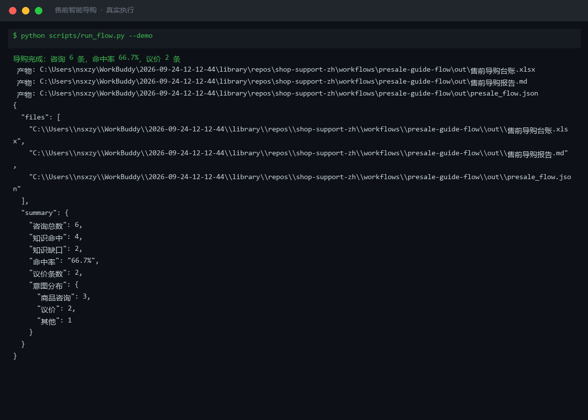

# 截图与录屏

> 以下素材均来自**真实执行**：`--run` 实拍终端 / 实跑产物文件，无摆拍。

## 演示视频


*第二帧为实跑结果数据*

## 执行截图



## 实跑产物

| 文件 | 说明 |
|---|---|
| [`out/presale_flow.json`](out/presale_flow.json) | 结构化结果（实跑生成） · 4 KB |
| [`out/售前导购台账.xlsx`](out/售前导购台账.xlsx) | Excel 工作簿（实跑生成） · 8 KB |
| [`out/售前导购报告.md`](out/售前导购报告.md) | Markdown 报告（实跑生成） · 2 KB |


---

## 附录：实跑输出明细

> 本资产为纯提示词客户端资产，无界面可截图。以下为**实跑运行效果**。

## 运行效果

### 输入

```json
{
  "input": "请提供工作流的初始输入数据"
}

```

### 输出

## 执行摘要

> 【AI 生成内容】

工作流因缺少初始输入数据，无法执行售前意图识别、知识库检索与话术生成。

---

## 分步结果

1. **步骤 1：商品知识库问答** — 未执行。原因：未收到用户咨询内容，无法识别意图及检索知识库。
2. **步骤 2：议价话术** — 未执行。原因：上一步无输出，无法生成对应应答话术与商品推荐。

---

## 最终交付物

请提供以下信息以启动工作流：

- `question`：用户原话或问题描述（必填，如"这款和另一款有什么区别""有没有优惠"）
- `knowledge`：商品知识库内容（必填，含规格、卖点、库存、价格政策等）
- `context`：当前活动或用户画像背景（可选）

补充后，系统将按「意图识别 → 知识库检索 → 话术生成 → 商品推荐」顺序执行。


---

*运行效果由实跑验证生成*
